# AGENT CONTROL PLANE — ARCHITECTURE

> **Status:** DESIGN — not implemented. No application code was modified to produce this document.
> **Design date:** 2026-07-27 · **Author role:** principal enterprise-systems architect
> **Scope of this document:** the structural design. The operation contract lives in
> `AGENT_OPERATION_CATALOG.md`, the security model in `AGENT_SAFETY_MODEL.md`, the preconditions in
> `AGENT_PHASE0_GATE.md`, the sequencing in `AGENT_ROLLOUT_PLAN.md`.
>
> **Locked decisions (not re-litigated here):** tiered autonomy (read free → propose/confirm writes →
> human approval for money above threshold); MCP server layered over a typed operation layer at
> `lib/agent/operations/*`; first vertical slice = Procurement PR → PO → GRN.

---

## 0. The thesis in one paragraph

This ERP is a **double-entry accounting system of record**. An agent driving it is not a productivity
feature; it is a **new posting principal** with machine-speed retry, machine-speed concurrency, and no
intuition about what a spinner means. The control plane's job is therefore not to "give the LLM tools" —
it is to make the ERP's write surface **safe to call from a client that will retry, fan out, and act on
whatever it just read**. Everything below follows from that: the operation layer exists so the agent can
never touch a table; the idempotency record exists so a retry cannot post twice; propose→confirm exists so
a human sees the journal before it is a journal; and Phase 0 exists because an agent writing into a system
that can silently drop a journal entry does not automate the business — it automates the corruption of its
books.

---

## 1. Layer model

```
┌─ UNTRUSTED ──────────────────────────────────────────────────────────────┐
│  Hermes (open-weight LLM)   ·   conversation   ·   ERP free-text in ctx   │
└──────────────────────────────┬───────────────────────────────────────────┘
                    ══════════ TRUST BOUNDARY ══════════
┌──────────────────────────────┴───────────────────────────────────────────┐
│  L1  MCP Transport            lib/agent/mcp/                              │
│      · tool exposure, ≤30 tools/session, describeCapabilities discovery   │
│      · schema-repair errors, payload ceilings, deadline propagation       │
├──────────────────────────────────────────────────────────────────────────┤
│  L2  Control Plane            lib/agent/runtime/                          │
│      · session grant verification (capability, tenant, limits, deadline)  │
│      · SoD deny-matrix · threshold routing · kill switch · concurrency cap│
│      · proposal store (propose→confirm) · AgentActionLog · correlation id │
├──────────────────────────────────────────────────────────────────────────┤
│  L3  Operation Layer  ★CONTRACT★   lib/agent/operations/<domain>/<op>.ts  │
│      · the BAPI equivalent. Zod in, AgentResult out. Versioned.           │
│      · dryRun simulation · idempotency key handling · Bahasa diff render  │
├──────────────────────────────────────────────────────────────────────────┤
│  L4  Canonical Server Actions  lib/actions/procurement.ts, grn.ts, …      │
│      · EXISTING code. The operation layer wraps it; it is not forked.     │
├──────────────────────────────────────────────────────────────────────────┤
│  L5  Transaction  withPrismaAuth → prisma.$transaction   lib/db.ts:62-67  │
│      · one operation = one transaction. Never held across an agent turn.  │
├──────────────────────────────────────────────────────────────────────────┤
│  L6  Postgres (Supabase, pgbouncer)  · documents · stock · GL             │
└──────────────────────────────────────────────────────────────────────────┘
```

**The single most important structural rule:** L3 is the contract. L4 is an implementation detail that L3 is
allowed to change (and, per Phase 0, *must* change in places). The agent never sees L4, L5, or L6 — no
Prisma, no SQL, no generic CRUD, no table names in any schema field description.

---

## 2. Control flow diagram

```mermaid
flowchart TD
    subgraph UNTRUSTED["🔴 UNTRUSTED ZONE — no capability originates here"]
        H["Hermes LLM<br/>(tool-calling)"]
        CTX["Context window<br/>· conversation<br/>· ERP free-text (supplier names,<br/>  PR notes, GRN inspection notes)<br/>· uploaded Excel / PDF text"]
        CTX -.->|"data, never instructions"| H
    end

    TB{{"═══ TRUST BOUNDARY ═══<br/>Session Grant verified server-side<br/>(agentPrincipal, onBehalfOfHuman,<br/>capabilities[], tenant, limits, deadline)"}}
    H -->|"MCP tool call + idempotencyKey"| TB

    subgraph L1["L1 · MCP Transport — lib/agent/mcp/"]
        MCP["MCP Server<br/>· ≤30 tools/session<br/>· describeCapabilities<br/>· strict Zod validate<br/>→ schema-repair error"]
    end
    TB --> MCP

    subgraph L2["L2 · Control Plane — lib/agent/runtime/"]
        KILL{"KILL SWITCH<br/>AGENT_WRITES_ENABLED?"}
        CAP{"Capability check<br/>operation × scope × limit"}
        SOD{"SoD deny-matrix<br/>(actor vs document history)"}
        CONC["Concurrency cap<br/>per principal (≤2 writes)"]
        LOG[("AgentActionLog<br/>append-only<br/>correlationId")]
    end
    MCP --> KILL --> CAP --> SOD --> CONC

    subgraph L3["L3 · OPERATION LAYER ★THE CONTRACT★ — lib/agent/operations/"]
        DESC["Operation descriptor<br/>id · version · riskTier<br/>inputSchema · outputSchema<br/>sideEffects · reversalOperation"]
        RISK{"riskTier?"}
        DRY["dryRun simulation<br/>→ exact GL lines,<br/>stock deltas, status change"]
        PROP["Proposal object<br/>proposalId · TTL 15m · single-use<br/>stateFingerprint<br/>Bahasa diff (message_id)"]
    end
    CONC --> DESC --> RISK

    RISK -->|READ| EXEC
    RISK -->|"WRITE_LOW / WRITE_MONEY /<br/>IRREVERSIBLE"| DRY --> PROP

    subgraph GATE["🟡 APPROVAL GATE — human, out of band"]
        HUMAN["Human reviewer<br/>reads Bahasa diff + simulated JE"]
        THRESH{"value ≥ threshold<br/>OR riskTier ≥ WRITE_MONEY?"}
    end
    PROP --> THRESH
    THRESH -->|no · WRITE_LOW| SELFC["confirm() by agent<br/>(only in Stage 3 autonomy)"]
    THRESH -->|yes| HUMAN
    HUMAN -->|"approve(proposalId)"| CONFIRM["confirm(proposalId)"]
    HUMAN -->|reject| REJ["AgentResult E/APPROVAL_DENIED"]
    SELFC --> CONFIRM

    CONFIRM --> DRIFT{"stateFingerprint<br/>still matches?"}
    DRIFT -->|no| STALE["AgentResult E/PROPOSAL_STALE<br/>retryable: re-propose"]
    DRIFT -->|yes| EXEC

    subgraph L45["L4/L5 · Canonical action inside ONE transaction"]
        direction TB
        TXB{{"══ TRANSACTION BOUNDARY ══<br/>withPrismaAuth → prisma.$transaction<br/>lib/db.ts:62-67 · maxWait 15s · timeout 20s"}}
        IDEM["① INSERT AgentOperationRecord<br/>UNIQUE(principal, operationId, idempotencyKey)<br/>← P2002 ⇒ return stored prior result"]
        PERIOD["② assertPeriodOpen(tx, date)"]
        GUARD["③ guarded transition<br/>updateMany({id, status: expected})<br/>+ count===0 ⇒ throw"]
        DOC["④ document write<br/>number via getNextDocNumber(tx)<br/>lib/document-numbering.ts:24"]
        STOCK["⑤ stock delta<br/>increment / gte-guarded decrement"]
        GL["⑥ postJournalEntry(data, tx)<br/>finance-gl.ts:332 — tx threaded"]
        STORE["⑦ UPDATE AgentOperationRecord<br/>← store result payload"]
        TXB --> IDEM --> PERIOD --> GUARD --> DOC --> STOCK --> GL --> STORE
    end
    EXEC --> TXB

    STORE --> COMMIT{{"COMMIT — all or nothing"}}
    COMMIT --> DB[("L6 · Postgres<br/>documents · stock_levels ·<br/>inventory_transactions ·<br/>journal_entries · gl_accounts")]
    COMMIT --> RES["AgentResult envelope<br/>severity · code · message_id · message_en<br/>retryable · remediation · fieldErrors[]"]
    RES --> LOG
    RES -->|"back through L1"| H

    COMMIT -.->|"any step throws"| RB["ROLLBACK — document, stock,<br/>GL, and idempotency record<br/>all vanish together"]
    RB --> RES

    INV["Post-write invariant job<br/>trial balance · orphan JE ·<br/>balance-vs-lines · stock-vs-ledger"]
    DB --> INV
    INV -->|FAIL| KILL

    style TB fill:#c62828,stroke:#000,stroke-width:4px,color:#fff
    style TXB fill:#1565c0,stroke:#000,stroke-width:4px,color:#fff
    style COMMIT fill:#1565c0,stroke:#000,stroke-width:3px,color:#fff
    style GATE fill:#fff8e1,stroke:#f57f17,stroke-width:3px
    style HUMAN fill:#ffb300,stroke:#000,stroke-width:3px
    style KILL fill:#c62828,stroke:#000,stroke-width:2px,color:#fff
    style L3 fill:#e8f5e9,stroke:#2e7d32,stroke-width:3px
    style UNTRUSTED fill:#ffebee,stroke:#c62828,stroke-width:2px
```



**Reading the three marked boundaries:**

| Boundary | Where exactly | What it guarantees |
|---|---|---|
| 🔴 **Trust boundary** | Between the model and L1. Crossed only by `(sessionGrantJWT, operationId, validated args, idempotencyKey)`. | Capability is carried by the **grant**, verified server-side per call. Nothing in the conversation, and nothing in any ERP text field, can widen it. Tenant and limits are re-read from the grant on every call, never from the request body. |
| 🔵 **Transaction boundary** | `withPrismaAuth` → `prisma.$transaction` (`lib/db.ts:62-67`). Opens *after* the approval gate, closes before the result returns. | One operation = one transaction. The idempotency record, the document, the stock delta, and the journal entry commit or roll back **together**. The transaction is never held across an agent turn — a proposal is a database row, not an open transaction. |
| 🟡 **Approval gate** | Between `propose*` and `confirm`. Out-of-band: the human approves in the ERP UI, not in the chat. | The agent cannot self-approve above threshold. The confirm is single-use, TTL-bounded, and re-validates a `stateFingerprint` so a proposal can never execute against drifted state. |

---

## 3. Traced example — `procurement.receiveGoods` end to end

The prompt requires one operation proved concretely. This is it. Every line reference below was
**read and verified on 2026-07-27**, not taken from the audit.

### 3.1 What exists today

`lib/actions/grn.ts:382` `acceptGRN(grnId, overrideReason?)`:

| Step | Line | What it does | Verdict |
|---|---|---|---|
| Auth | `grn.ts:384-385` | `getAuthzUser()` + `assertRole(user, RECEIVING_ROLES)` (`grn.ts:19`) | role-blob — replaced by capability at L2 |
| Tx open | `grn.ts:388` | `withPrismaAuth(async (prisma) => {…})` → `$transaction` (`lib/db.ts:63-66`) | ✅ correct |
| Read GRN | `grn.ts:392-402` | `findUnique` on the **tx client** | ✅ |
| SoD | `grn.ts:409-443` | looks for a prior `APPROVE` `purchaseOrderEvent` by the same user; if found requires a ≥10-char `overrideReason` and writes a `SOD_OVERRIDE` event | ✅ exists, but soft (override always available) |
| Guarded transition | `grn.ts:448-458` | `updateMany({where:{id, status:'DRAFT'}})` + `count===0 ⇒ throw` | ✅ **atomic** — a concurrent second accept cannot pass |
| Over-receive guard | `grn.ts:473-491` | `updateMany({where:{id, receivedQty:{lte: quantity - accepted}}, data:{increment}})` + `count===0 ⇒ throw` | ✅ **atomic** |
| Ledger row | `grn.ts:499-511` | `inventoryTransaction.create` on the tx client, `type:'PO_RECEIVE'` | ✅ |
| Stock | `grn.ts:515-543` | `findFirst` → `update{increment}` **or** `create` | ⚠️ TOCTOU on the create branch, see §3.4 |
| GL | `grn.ts:551-560` | `postInventoryGLEntry(prisma /* = tx */, {...})` | ✅ tx threaded |
| GL result check | `inventory-gl.ts:176-181` | `if (!result?.success) throw` | ✅ **blocking** — GL failure rolls the whole tx back |
| GL posting | `finance-gl.ts:332-334` | `if (txClient) return postJournalEntryInner(txClient, data)` | ✅ joins caller's tx |
| JE number | `inventory-gl.ts:160` → `:96-101` | `getNextDocNumber(tx, "JV-INV-YYYYMMDD", 6)` — atomic upsert (`lib/document-numbering.ts:24-28`) | ✅ **race-free** |
| PO auto-transition | `grn.ts:566-649` | wrapped in its own `try/catch`, failure logged as a `PO_TRANSITION_FAILED` event, does **not** roll back | ⚠️ deliberate; see §3.5 |
| Post-commit | `grn.ts:657-659` | `recalculateVendorRating(grnId)` **unawaited**, uses the global singleton `prisma` | ⚠️ see §3.4 |

**Journal entry produced** (`inventory-gl.ts:128-130`, account constants at `:56-62`):

```
DR  1300  Persediaan (Inventory Asset)        totalValue
    CR  2150  GR/IR Clearing                              totalValue
description : "Penerimaan barang dari PO - {productName} — {JV-INV-…}"
reference   : JV-INV-YYYYMMDD-000123
link        : inventoryTransactionId → the ledger row created at grn.ts:499
```

One JE **per accepted GRN line** (the loop at `grn.ts:465`), all inside the one transaction.

### 3.2 The transaction boundary — proved

`withPrismaAuth` (`lib/db.ts:41-72`) awaits `supabase.auth.getUser()` (`:53`), then calls
`basePrisma.$transaction(async (tx) => operation(tx))` with `{maxWait:15000, timeout:20000}` (`:63-66`).
Every write inside `acceptGRN` uses the `prisma` parameter, which **is** the `tx` client. `postJournalEntry`
receives it as `txClient` and short-circuits to `postJournalEntryInner(txClient, data)` at `finance-gl.ts:333`
— **no second connection, no second transaction**. If `postJournalEntryInner` throws (missing GL account,
unbalanced lines, control-account guard at `finance-gl.ts:250-258`), `postJournalEntry` catches and returns
`{success:false}` (`finance-gl.ts:343-346`), `postInventoryGLEntry` re-throws (`inventory-gl.ts:177`), the
throw escapes `withPrismaAuth`, and Postgres rolls back the GRN status flip, the `receivedQty` increment,
the `inventoryTransaction` row, the `stockLevel` increment **and** the `DocumentCounter` bump — atomically.

**This is the correct reference pattern and the operation layer must not weaken it.**

### 3.3 The idempotency story — the concrete failure, and the fix

**Today there is none.** There is no idempotency model in `prisma/schema.prisma` and `acceptGRN` takes no
key. Trace the agent's actual retry:

1. Agent calls `receiveGoods(grnId)`. The server commits at t=19.8s.
2. The MCP client's 20s deadline fires at t=20.0s. The agent sees a timeout.
3. Agent retries `receiveGoods(grnId)`.
4. `grn.ts:448` runs `updateMany({where:{id, status:'DRAFT'}})` → **count 0** (status is now `ACCEPTED`).
5. `grn.ts:457` throws `"GRN sudah diproses atau tidak ditemukan. Refresh halaman."`
6. `grn.ts:676` returns `{success:false, error:"GRN sudah diproses…"}`.

The agent is told its operation **failed**. It actually **succeeded**. There is no way for the agent to tell
"my own retry landed on my own success" apart from "a colleague accepted this GRN 30 seconds ago". The
plausible agent recovery — *"receiving didn't go through, let me create another GRN"* — is the dangerous one:

- `createGRN` (`grn.ts:262`) has **no idempotency key** and generates a fresh number each call
  (`grn.ts:277-282`).
- Its only protection is the remaining-quantity check at `grn.ts:332-341`, which sums `quantityReceived`
  across *all* existing GRN items including DRAFT ones. So a retry of a **full** receipt is rejected
  (remaining = 0) — but a retry of a **partial** receipt (50 of 100) succeeds and creates a second GRN
  for 50. That second GRN, once accepted, posts a **second** `DR 1300 / CR 2150` for goods that arrived once.

**Idempotency here is quantity-dependent, not structural. That is not a safety property.**

**Required design (Phase 0, blocking):**

```prisma
model AgentOperationRecord {
  id             String   @id @default(dbgenerated("uuid_generate_v4()")) @db.Uuid
  principal      String                 // agent principal id from the session grant
  operationId    String                 // e.g. "procurement.receiveGoods"
  idempotencyKey String
  correlationId  String
  status         AgentOpStatus @default(IN_FLIGHT)   // IN_FLIGHT | SUCCEEDED | FAILED
  requestHash    String                 // sha256 of canonicalised input
  resultJson     Json?                  // the exact AgentResult to replay
  createdAt      DateTime @default(now())
  completedAt    DateTime?

  @@unique([principal, operationId, idempotencyKey])
  @@index([correlationId])
}
```

The `INSERT` happens **as the first statement inside the same `$transaction`** (step ① in the diagram):

- Insert succeeds → proceed. On commit, the record and the GRN commit together.
- Insert raises `P2002` → this key was used before. Read the stored row:
  - `SUCCEEDED` → return `resultJson` verbatim with `severity:'S'`, `code:'REPLAYED'`. The agent sees its
    original success. **This is the fix for the trace above.**
  - `IN_FLIGHT` → return `code:'IN_PROGRESS'`, `retryable:true`, `remediation` = poll after backoff.
    (A crashed in-flight row is reaped by a sweeper after the 20s tx timeout + margin.)
  - `FAILED` with the same `requestHash` → return the stored failure.
- `requestHash` mismatch on the same key → `code:'IDEMPOTENCY_KEY_REUSED'`, severity `E`, **not** retryable.
  Reusing a key with different arguments is an agent bug and must be surfaced, never silently honoured.

Because the record is written **inside** the transaction, a rollback also erases the key — so a genuine
failure is retryable with the *same* key, which is exactly what a retrying agent will do.

### 3.4 Residual defects found while tracing (new — not in the audit)

| # | Finding | Evidence | Impact on the agent slice |
|---|---|---|---|
| **T-1** | **Posting-period control is bypassed on every GRN GL post.** `postJournalEntry` calls `assertPeriodOpen` **only on the standalone branch** (`finance-gl.ts:338`); when a `txClient` is passed it returns at `:333` before that line. `grn.ts` never imports or calls `assertPeriodOpen` (grep: zero hits in the file), and `procurement.ts` imports it at `:14` but **never calls it**. The comment at `inventory-gl.ts:165-167` claims the delegate gets "the period assertion … for free" — it does not. | `finance-gl.ts:332-338`, `inventory-gl.ts:164-175`, `grn.ts` (no hits), `procurement.ts:14` | An agent can post inventory receipts into a **closed fiscal period**. Blocks `receiveGoods`. Fix = `assertPeriodOpen(tx, date)` as step ② of the operation, before any write. |
| **T-2** | **`assertPeriodOpen` uses the singleton client, not the tx client.** `lib/period-helpers.ts:1` imports `prisma` from `lib/db`; `:15` queries `prisma.fiscalPeriod`. Called inside a `withPrismaAuth` block it acquires a **second pooled connection while a transaction is open**. | `lib/period-helpers.ts:1,15` | R-05 amplifier. The operation layer must call a tx-accepting variant. |
| **T-3** | **`getEmployeeForUserEmail` runs on the singleton client from inside the transaction.** Declared at `grn.ts:41-48` using the module-scope `prisma` (`grn.ts:3`), invoked at `grn.ts:446` — i.e. after `withPrismaAuth` opened the tx at `:388`. Same pattern in `createGRN` at `:267` (that one is outside the tx, harmless). | `grn.ts:43` + `grn.ts:446` | Every `acceptGRN` holds 2 connections. At `connection_limit=10` (`lib/db.ts:22`) an agent batch-receiving 5 GRNs concurrently consumes the pool. Must be threaded onto `tx`. |
| **T-4** | **`recalculateVendorRating` is an unawaited post-commit fan-out.** `grn.ts:657` fires it without `await`; the function (`grn.ts:784-853`) issues 4 further queries on the singleton client, including an unbounded `gRNItem.aggregate` across the whole supplier history (`:825-832`). | `grn.ts:657-659`, `:784-853` | Connection pressure the caller cannot see or bound. For the agent slice it must be a queued job (`jobId`), not fire-and-forget. |
| **T-5** | **The GL entry is dated wrong.** `grn.ts:559` passes `transactionDate: grn.receivedAt ?? grn.createdAt`. **`GoodsReceivedNote` has no `receivedAt` field** — the model (`prisma/schema.prisma:1407-1437`) has `receivedDate` (`:1413`), `acceptedAt` (`:1420`), `rejectedAt` (`:1422`), `createdAt` (`:1431`). So the expression always resolves to `grn.createdAt`. | `grn.ts:559` vs `schema.prisma:1407-1437` | Accrual period-matching is silently wrong whenever the GRN is created in one period and accepted in another. Blocks `receiveGoods` (Layer 6 of the accounting SOP). One-character-class fix: `grn.receivedDate`. |
| **T-6** | **No DB guard against a duplicate JE for the same inventory transaction.** `JournalEntry.inventoryTransactionId` (`schema.prisma:2294`) is nullable, non-unique, and the reverse relation is `journalEntries JournalEntry[]` (`schema.prisma:429`) — one-to-many. `JournalEntry` has **no `number` field** at all and `reference` is `String?` with no `@unique` (`schema.prisma:2276`). | `schema.prisma:2276, 2294, 429` | The idempotency record is the *only* thing standing between a retry and a double posting. There is no second line of defence. Recommend a partial unique index on `(inventoryTransactionId)` for `sourceDocumentType LIKE 'INVENTORY_%'`. |
| **T-7** | **Stock ledger cannot represent a fabric receipt.** `InventoryTransaction.quantity` is `Int` (`schema.prisma:408`) while `StockLevel.quantity` is `Decimal(18,4)` (`schema.prisma:381`). | `schema.prisma:381, 408` | This is a **textile** ERP. An agent receiving 2.5 m of fabric writes 2.5 to stock and cannot write 2.5 to the ledger. The stock-vs-ledger invariant (R-22) can never pass for fractional units. Blocks `receiveGoods` for any non-integer UoM. (= R-13, confirmed.) |
| **T-8** | **`approvePurchaseOrder` is atomic for the PO but not for its downstream bill.** The guarded transition is correct (`procurement.ts:991-1001`), but `recordPendingBillFromPO(po)` is called at `procurement.ts:1019` — **after** `withPrismaAuth` returned, and its result is **not checked**. That function returns `{success:false, error:"Finance Sync Failed"}` on any error (`finance-invoices.ts:822`). | `procurement.ts:1017-1019`, `finance-invoices.ts:731, 822` | Severity is bounded: the bill is created in `DRAFT` with **no GL posting** (`finance-invoices.ts:795-813`), which is *correct* accrual behaviour (expense recognises at bill approval, not PO approval). So the failure mode is "PO approved, draft bill missing", recoverable via the backfill at `procurement.ts:1306-1313`. The operation must declare it in `sideEffects` and the invariant job must detect it. |
| **T-9** | **Bill numbering is racy.** `finance-invoices.ts:777-784` uses `invoice.count({where:{number:{startsWith:…}}})` then computes `-NN`. | `finance-invoices.ts:777-784` | = R-17. Two agent-approved POs for the same PO number could collide. `Invoice.number` uniqueness must be confirmed; route through `getNextDocNumber`. |
| **T-10** | **`StockLevel` create branch is a TOCTOU, saved only by a partial index.** `grn.ts:515-541` does `findFirst` → `create`. The Prisma `@@unique([productId, warehouseId, locationId])` (`schema.prisma:392`) does **not** cover `locationId IS NULL` (Postgres treats NULLs as distinct). Migration `20260423140000_stock_level_partial_unique` adds `stock_levels_warehouse_no_location_unique … WHERE "locationId" IS NULL`, which does. | `grn.ts:515-541`, `schema.prisma:392`, migration `20260423140000` | Fails **closed** (P2002 → rollback), which is right for accounting, but produces an opaque error. The `AgentResult` mapper must translate P2002 on that index to `retryable:true` with a Bahasa remediation. Should be an `upsert`. |

**Net verdict on the traced operation:** `acceptGRN` is the **best** write path in this repo — genuinely
atomic, genuinely guarded, GL genuinely blocking. And it still carries **six** defects that a human clicker
survives and an agent does not. That ratio is the argument for Phase 0.

### 3.5 What the operation wrapper adds

`lib/agent/operations/procurement/receiveGoods.ts` does **not** reimplement `acceptGRN`. It:

1. Validates a flat Zod input (`grnId`, `idempotencyKey`, optional `sodOverrideReason`).
2. Resolves capability + SoD at L2 (the `RECEIVING_ROLES` blob at `grn.ts:19` is **not** the authority).
3. On `dryRun`, replays the read half — GRN lines, `unitCost`, `quantityAccepted` — and renders the exact
   `DR 1300 / CR 2150` lines and stock deltas **without opening a write transaction**.
4. On execute, calls a Phase-0-hardened `acceptGRN(grnId, {idempotencyKey, correlationId, actor, txHooks})`
   whose signature is extended to accept the key and thread it into the same transaction.
5. Maps the thrown `Error` strings into stable `AgentResult` codes (`GRN_ALREADY_PROCESSED`,
   `OVER_RECEIPT`, `SOD_REASON_REQUIRED`, `PERIOD_CLOSED`, `GL_ACCOUNT_MISSING`, `STOCK_ROW_CONFLICT`).
   **Free-text error strings are never returned to the agent** — a stable code plus a bilingual message is.
6. Writes the `AgentActionLog` row with before/after field diffs.

The PO auto-transition block (`grn.ts:566-649`) stays deliberately non-blocking and is surfaced in the
`AgentResult` as a `severity:'W'` warning line, so the agent is told "barang diterima, status PO belum
diperbarui" rather than silently believing the PO advanced.

---

## 4. `AgentResult` — the BAPIRET2 equivalent

Every operation returns this envelope, success or failure. There is no other return shape.

```ts
type Severity = 'S' | 'I' | 'W' | 'E' | 'A'   // Success · Info · Warning · Error · Abort

interface AgentMessage {
  severity: Severity
  code: string            // stable, machine-matchable, SCREAMING_SNAKE. Never a stack trace.
  message_id: string      // Bahasa Indonesia — what the human reviewer reads
  message_en: string      // English — what the model reasons over
  field?: string          // dotted path into inputSchema, when field-scoped
}

interface AgentResult<T> {
  ok: boolean
  correlationId: string
  operationId: string
  operationVersion: string
  idempotencyKey: string
  replayed: boolean                 // true when served from AgentOperationRecord
  data?: T                          // conforms to outputSchema
  messages: AgentMessage[]          // ≥1 always; messages[0] is the primary
  retryable: boolean
  retryAfterMs?: number
  remediation?: { message_id: string; message_en: string; suggestedOperation?: string }
  fieldErrors?: AgentMessage[]      // schema-repair payload
  truncated?: { field: string; returned: number; total: number }
  simulation?: {                    // present iff dryRun
    journalLines: { accountCode: string; accountName: string; debit: number; credit: number }[]
    stockDeltas: { productId: string; productName: string; warehouseId: string; delta: number; unit: string }[]
    statusChanges: { entity: string; id: string; from: string; to: string }[]
    documentsCreated: { type: string; previewNumber: string }[]
  }
}
```

**Rules.** `ok:false` never carries partial `data`. `retryable` is the agent's only retry signal — a
transient `P1001`/`P2024` is `true`, a business-rule rejection is `false`. `remediation` must state the
*next action*, not describe the error ("Buat GRN baru untuk sisa 50 unit", not "constraint violated").
Errors **teach**; they do not narrate.

**Bahasa first.** `message_id` is authored first and is what appears in the proposal card, the approval
screen, and the audit log. `message_en` is a translation for the model. Terms follow shop-floor usage:
*surat jalan masuk / penerimaan barang* (GRN), *permintaan pembelian* (PR), *pesanan pembelian* (PO),
*persediaan* (stock), *jurnal* (journal entry), *periode fiskal* (fiscal period).

---

## 5. Read path — why it is a separate design

Reads look harmless and are the most likely source of a silently-wrong agent decision.

**Three rules, all Phase 0 blocking:**

1. **Reads are not wrapped in interactive transactions.** `withPrismaAuth` wraps *everything*, reads
   included, in a 20s interactive transaction (`lib/db.ts:62-67`). Agent read operations use a plain
   pooled query. Rationale: R-05, and a read has nothing to roll back.
2. **Reads never return a fallback.** Today the procurement/GRN reads the slice needs are exactly the ones
   that lie: `getPendingPOsForReceiving` swallows into `FALLBACK_PENDING_POS` (`grn.ts:79-98`, imported at
   `grn.ts:11`) and then re-swallows into `[]` (`grn.ts:134-137`); `getAllGRNs` returns `[]` on any error
   (`grn.ts:189-192`); `getGRNById` returns `null` (`grn.ts:252-255`); `getWarehousesForGRN` returns `[]`
   (`grn.ts:742-745`); `getEmployeesForGRN` returns `[]` (`grn.ts:769-772`). An agent asked "apakah ada PO
   yang belum diterima?" during a DB blip is told **"tidak ada"** — and may then create a duplicate PO. The
   agent read operations wrap the underlying query directly and return
   `severity:'E', code:'READ_FAILED', retryable:true`. **A read that cannot be trusted must fail, not
   return `[]`.**
3. **Reads bypass the client cache.** `lib/query-client.tsx` serves 5-minute-stale, IndexedDB-persisted,
   `offlineFirst` data (R-11). Agent reads go server-side only; they never traverse TanStack Query.

Plus the ergonomics: hard `pageSize` ceiling (default 25, max 100), cursor pagination, explicit field
projection, a ~32 KB payload ceiling per response, and a `truncated` block naming what was cut. Agents
blow their context on unbounded lists and then reason over the half they can still see.

---

## 6. Where this design deliberately does *not* trust the existing system

| Existing mechanism | Why the control plane does not rely on it | What replaces it |
|---|---|---|
| `assertRole(user, [...])` role blobs (`grn.ts:19`; `procurement.ts:37-40`) | **Verified 2026-07-27 — worse than the audit stated.** `assertRole` auto-grants `ADMIN` unconditionally (`lib/authz.ts:64-72`, `normalizeRole` at `:60-62` collapses `ROLE_ADMIN`/`admin`/`Admin` → `ADMIN`, bypassing every allow-list). The role is read from Supabase `user_metadata` **first** (`lib/authz.ts:19-21`) and the DB `User` row is consulted only `if (!role \|\| !employeeId)` (`:24`) and then only `if (!role)` (`:34`) — **the DB can never override metadata**, and `user_metadata` is client-writable via `supabase.auth.updateUser({data:{role:'ADMIN'}})`. Worse, a DB failure in the fallback is caught and only logged (`:44-46`), silently degrading to `ROLE_STAFF` (`:49`) rather than denying. And there are **two divergent implementations**: `lib/auth/role-guard.ts:63-66` does *not* strip the `ROLE_` prefix, so `ROLE_CEO` fails an allow-list entry of `CEO` there but passes in `authz.ts`. | L2 capability check: `(operation × scope × limit)` from the signed session grant. The grant is issued by an out-of-band admin flow and is **never** derived from `user_metadata`, `assertRole`, or either role-guard module. Existing `assertRole` calls inside the canonical actions remain as defence-in-depth but are not the authority. |
| `middleware.ts` route protection | Excludes `/api/` — matcher at `middleware.ts:177`: `"/((?!api/\|_next/static\|…).*)"`, deliberate per the comment at `:170-171`. Protection is a hardcoded page-prefix list at `:73-88` matched with `startsWith` (`:93-95`). **Additionally verified:** `middleware.ts:103-107` returns the response *without* auth enforcement when the request carries an `rsc: 1` or `next-router-prefetch: 1` header — both attacker-supplied, so even the "protected" page routes can be fetched unauthenticated. | The MCP server is a **single** authenticated entry point that calls the operation layer in-process. It never proxies to an API route or a page route, so it inherits none of this. This does **not** fix the underlying holes — see the honest-risk note: anything the agent could reach through an unauthenticated route bypasses the control plane entirely, which is why the security audit must run before writes are enabled. |
| `lib/actions/finance.ts` | `CLAUDE.md` declares it stale, yet 14 live UI files still import it (`app/finance/bills/page.tsx:48`, `app/finance/vendor-payments/page.tsx:30`, `app/finance/journal/new/page.tsx:28`, `components/finance/vendor-multi-payment-dialog.tsx:34`, `components/finance/accounting-module-actions.tsx:18`, `components/finance/nota-kredit-tab.tsx:17`, `components/finance/nota-debit-tab.tsx:15`, +7 more — verified 2026-07-27) | **Binding rule:** no operation may import `lib/actions/finance.ts`. Enforced by an ESLint `no-restricted-imports` rule scoped to `lib/agent/**` and a catalog lint that asserts every operation's `boundAction` resolves to an allowlisted canonical module. |
| `safeQuery(…, FALLBACK_*)` | Converts outages into plausible zeros | Agent reads use the raw query + `AgentResult` error path |
| Client cache (`lib/query-client.tsx`) | 5-min stale, 7-day IndexedDB, `offlineFirst` | Agent reads are server-side and uncached |

---

## 7. Tool budget & discovery (MCP layer)

Open-weight tool-callers degrade as the tool list grows. The procurement slice is sized to fit.

- **Per-session cap: ≤ 30 tools.** The procurement slice ships **21** (see catalog) — 9 reads, 6 propose,
  1 confirm, 1 cancel, 2 reversals, 2 meta.
- **`agent.describeCapabilities(domain?)`** is the discovery tool (the OData `$metadata` equivalent). It
  returns the operation descriptors — id, version, bilingual title/description, JSON Schema, riskTier,
  requiredCapability, whether the *current grant* actually permits it, and remaining limit headroom. The
  agent discovers at runtime; nothing is hardcoded in a system prompt.
- **Scoping by module.** A session grant names its domains. A grant scoped to `procurement` never sees
  finance or HCM tools at all — they are not in the tool list, so they cannot be hallucinated into.
- **Schema ergonomics.** Flat objects only (no nesting beyond one array of line items). Enums over free
  text. Explicit units (`quantity` + `unit`) and currency (`amountIdr`, integer rupiah — no floats, no
  implicit currency). ISO-8601 dates. No polymorphic unions. Every field carries a one-line description in
  both languages. Strict validation with a `schema-repair` error naming the field, the expectation, and a
  valid example, so the model can self-correct in one turn rather than guessing.

---

## 8. Long-running work — the IDoc equivalent

Any operation whose realistic p99 approaches the 20s transaction timeout (`lib/db.ts:66`) does not block.
It returns `{ jobId, status:'QUEUED' }` immediately and the agent polls `agent.getJobStatus(jobId)`.

In the procurement slice only two qualify: bulk PR→PO conversion over many lines, and the vendor-rating
recalculation currently fired unawaited at `grn.ts:657` (T-4). Everything else is a single-document
operation well inside the budget. The rule exists so that **no agent call ever holds a database connection
while the model thinks**.

---

## 9. Observability

- **`correlationId`** is minted per agent *episode* (one user intent), carried in the session grant
  context, stamped on every `AgentResult`, every `AgentActionLog` row, every `AgentOperationRecord`, and
  every log line the operation emits. It is the join key for episode replay.
- **`AgentActionLog`** (append-only, no update, no delete): `correlationId`, `agentPrincipal`,
  `onBehalfOfHuman`, `operationId`, `operationVersion`, redacted inputs, `proposalId`, human decision +
  decider + timestamp, before/after field diff, `AgentResult` summary, duration. This is the
  CDHDR/CDPOS equivalent and is the artifact an auditor asks for.
- **Episode replay** reconstructs the full turn sequence from `correlationId` for incident review.
- **Post-write invariant job** (R-22): trial balance `SUM(debit)==SUM(credit)`; every non-DRAFT document has
  a POSTED JE; `GLAccount.balance` equals the sum of its lines; `StockLevel` equals the running sum of
  `InventoryTransaction`. Runs after every agent write batch. **A failure trips the kill switch.** It
  depends on the R-12 indexes to be fast enough to run this often.

---

## 10. SAP spine — row-by-row verdict

| SAP concept | Verdict | Where / why |
|---|---|---|
| **BAPI** (stable business API) | **DESIGNED** | `lib/agent/operations/<domain>/<op>.ts`, descriptor in `AGENT_OPERATION_CATALOG.md` §2. Business verbs only; Prisma/SQL/table names never appear in any agent-visible schema. |
| **BAPIRET2** (typed return) | **DESIGNED** | `AgentResult` envelope, §4. Bilingual, stable codes, `retryable`, `remediation`, `fieldErrors[]`. |
| **BAPI_TRANSACTION_COMMIT/ROLLBACK** | **DESIGNED** | §2 transaction boundary; one operation = one `$transaction`; never held across a turn. Proved in §3.2. Requires Phase 0 items G-04/G-05 (T-2, T-3) so the boundary is not leaked by singleton-client calls. |
| **TESTRUN / posting simulation** | **DESIGNED** | `dryRunSupported: true` on every mutation; `AgentResult.simulation` returns the exact JE lines, stock deltas and status changes. It is the payload the human approves. |
| **Belegprinzip** (document principle) | **DESIGNED** | Every mutation creates a document and, where money moves, a balanced JE in the same transaction. POSTED documents are never edited in place. |
| **Storno** (reversal, FB08) | **DESIGNED** | Catalog contains **zero** delete operations. Every `WRITE_MONEY`/`IRREVERSIBLE` op declares a `reversalOperation`. Where the counter-operation does not yet exist in the codebase (goods return-out), the forward operation is **not exposed** until it does — see catalog §5. |
| **Change documents (CDHDR/CDPOS)** | **DESIGNED** | `AgentActionLog`, §9. Append-only, field-level before/after, dual actor `(agentPrincipal, onBehalfOfHuman)`, correlation id. |
| **Authorization objects** (activity × org level) | **DESIGNED** | `(operation × scope × limit)` capability model, `AGENT_SAFETY_MODEL.md` §2. Explicitly independent of `assertRole` and of Supabase `user_metadata`. |
| **SoD / GRC risk rules** | **DESIGNED** | Deny-matrix in `AGENT_SAFETY_MODEL.md` §3. Note the codebase already has two hand-rolled SoD checks — hard at `procurement.ts:983-985`, soft-with-override at `grn.ts:409-443` — which the matrix subsumes and makes uniform. |
| **Release strategy** (value-based approval) | **DESIGNED** | Threshold bands in `AGENT_SAFETY_MODEL.md` §4; the agent can never self-approve above threshold, and never approves its own proposal in Stages 1–2. |
| **Number ranges (SNRO)** | **DESIGNED — already largely satisfied in this slice** | `getNextDocNumber` (`lib/document-numbering.ts:19-30`) is an atomic `documentCounter.upsert` + `increment`, backed by `@@unique([prefix])` (`schema.prisma:3938`). **Verified 2026-07-27:** `lib/actions/procurement.ts` contains **zero** `count()+1` / `findFirst orderBy desc` numbering patterns — PR numbers (`procurement.ts:546`), PO numbers (`procurement.ts:850`), direct-purchase PO/GRN/BILL (`:2259, :2311, :2386`) and debit notes (`:2576`) all route through it, as do GRN (`grn.ts:282`) and the inventory JE (`inventory-gl.ts:96-101`). **The one residual gap in the slice is downstream:** vendor-bill numbering is `invoice.count({where:{number:{startsWith}}})` + `-NN` at `finance-invoices.ts:777-784` (T-9), reached from `approvePurchaseOrder` at `procurement.ts:1019`. Phase 0 item G-08. Note `DocumentCounter` has no tenant or year-reset column (`schema.prisma:3931-3940`) — a single global row per prefix; acceptable while tenancy is single. |
| **Posting period control** | **DESIGNED — currently BROKEN, Phase 0 blocking** | T-1: `assertPeriodOpen` is skipped on the tx-threaded branch (`finance-gl.ts:332-338`) and `grn.ts` never calls it. The operation layer makes `assertPeriodOpen(tx, date)` a mandatory step ② for every posting operation. Phase 0 item G-06. |
| **Duplicate invoice check** | **DESIGNED — currently ABSENT, Phase 0 blocking** | No idempotency model exists in the schema. `AgentOperationRecord` with `@@unique([principal, operationId, idempotencyKey])`, inserted inside the transaction. §3.3. Phase 0 item G-01. |
| **OData `$metadata`** | **DESIGNED** | `agent.describeCapabilities()`, §7. Generated from the descriptors — a single source of truth, no drift between docs and behaviour. |
| **IDoc status handling** | **DEFERRED (scoped)** | §8. Only two procurement operations warrant it and neither is in the Stage-1 slice. **Rationale:** building a durable job runner is a large amount of new infrastructure whose failure modes (orphaned jobs, at-least-once delivery, poison messages) are themselves agent hazards, and no Stage-1 operation exceeds the 20s budget. **Deferred to:** the second domain (manufacturing WO completion) or the first operation measured >10s p99, whichever is first. **Risk owner:** platform lead. **Interim control:** any operation whose p95 exceeds 10s is removed from the tool list until it is either optimised or jobified. |

Two further rows are **deferred by scope, not by design**, and are recorded here so they are not lost:

| Concept | Verdict | Rationale |
|---|---|---|
| **Multi-tenancy enforcement** | **DEFERRED** | The grant carries `tenant` and the control plane enforces it, but the underlying schema has no tenant column on the procurement models (verified: `PurchaseOrder`, `GoodsReceivedNote` have no tenant/org field). Until row-level tenancy exists, the grant's `tenant` claim is a **single-tenant assertion**, not an isolation boundary. **Risk owner:** platform lead. **Interim control:** one tenant per deployment; the manifest declares `tenancy: "single"` so no future operation can assume otherwise. |
| **Workflow / release procedure engine** | **DEFERRED** | Approval routing is a flat threshold table, not a multi-level release strategy with agent-determined approvers. **Rationale:** SME target users (per `CLAUDE.md` design principles) do not need multi-level release; adding it now adds configuration surface with no user problem behind it. **Deferred to:** whenever a customer needs a second approval level. **Risk owner:** product. |

---

## 11. The five riskiest aspects, and what mitigates each

| # | Risk | Why it is the top of the list | Mitigation |
|---|---|---|---|
| **1** | **Retry double-posting.** No idempotency infrastructure exists anywhere in the schema. The traced retry of `receiveGoods` returns *failure* for an operation that *succeeded* (`grn.ts:448-458`), and the natural agent recovery — create another GRN — is unguarded for partial receipts (`grn.ts:332-341`). Result: goods received once, `DR 1300 / CR 2150` posted twice. | Machine retry is not an edge case; it is the default behaviour of every MCP client on a timeout. And `lib/db.ts:152-184` `withRetry` *already* retries transparently one layer down. | `AgentOperationRecord` unique on `(principal, operationId, idempotencyKey)`, inserted **inside** the transaction, replaying the stored `AgentResult` on `P2002` (§3.3). Mandatory `idempotencyKey` on every mutation — an operation with no key is rejected at L1, never executed. Backed by a partial unique index on `JournalEntry.inventoryTransactionId` for inventory postings (T-6) as a second line of defence. |
| **2** | **The agent reasons over fabricated zeros.** Every read the procurement slice needs currently swallows DB errors into `[]`/`null`/`FALLBACK_*` — `grn.ts:79-98`, `:134-137`, `:189-192`, `:252-255`, `:742-745`, `:769-772`; plus R-06's fully-zeroed HTTP-200 dashboard. | A human sees an empty list and reloads. An agent sees an empty list and **concludes**, then acts on the conclusion — creating a duplicate PO because "there are no open POs", or approving a payment because "AR shows Rp 0 outstanding". This turns an outage into a posting. | No agent-reachable read may return a fallback (§5, Phase 0 item G-07). Every read returns `severity:'E', code:'READ_FAILED', retryable:true`. Agent reads bypass the 5-minute-stale client cache entirely. Sanity assertions in the operation layer: a read that returns zero rows where the caller asserted `expectNonEmpty` returns `severity:'W'` so the model is told the emptiness is surprising. |
| **3** | **Prompt injection through ERP free-text.** Supplier names, PR justifications, GRN `inspectionNotes` (`grn.ts:249`), uploaded Excel, and Xendit webhook payloads all land in the agent's context. `inspectionNotes` in particular is written by the same warehouse staff whose GRN the agent then acts on. | The injected string does not need to make the agent do something impossible — it only needs to make it do something *permitted but wrong*: pick a different supplier, receive a different quantity, choose the vendor's preferred bank account. That is entirely inside the capability envelope. | Capability derives **only** from the signed session grant, re-verified server-side per call; it is never inferred from content (`AGENT_SAFETY_MODEL.md` §5). ERP text is delivered in a fenced `data` channel, never as instructions. Any operation whose parameters trace to ERP free-text is flagged `provenance:'ERP_TEXT'` on the proposal and forced through human review regardless of value band. Master-data mutations (supplier bank details, addresses) are excluded from the agent catalog entirely in Stage 1. Must-refuse evaluation set covers injected instructions before any autonomy increase. |
| **4** | **Connection-pool exhaustion turning into partial-looking failures.** `withPrismaAuth` wraps every operation, reads included, in a 20s interactive transaction (`lib/db.ts:62-67`) at `connection_limit=10` (`lib/db.ts:22`) — while the file's own comment says the pooler allows ~15 and "we use 5" (`lib/db.ts:13-15`). The traced operation makes it worse: `getEmployeeForUserEmail` (T-3) and `assertPeriodOpen` (T-2) each grab a **second** connection from inside an open transaction, and `recalculateVendorRating` (T-4) fans out four more after commit. An agent fanning out reads while a write is in flight is the exact load shape this design cannot absorb. | Exhaustion presents as a 20s timeout — i.e. as *risk #1*. The pool is the mechanism by which concurrency becomes double-posting. | Per-principal concurrency cap (≤2 concurrent writes, ≤4 reads), enforced at L2 with a queue, sized against the pool budget. Read operations are **not** wrapped in interactive transactions. Every per-call deadline is propagated and is shorter than the 20s tx timeout, so the client gives up *after* the server does, not before. T-2/T-3 threaded onto `tx`; T-4 becomes a queued job. Request deadline + `maxDuration` on the MCP route. |
| **5** | **Approving against drifted state, and the blast radius of a wrong approval.** A proposal shows a human a Rp 180 juta PO; between preview and confirm, a colleague edits the lines, another GRN consumes the remaining quantity, or the fiscal period closes. Compounding it: `submitPOForApproval` (`procurement.ts:945`) and `rejectPurchaseOrder` (`procurement.ts:1041`) still use **unguarded** `update({where:{id}})` — verified, = R-16 — so concurrent transitions silently last-write-wins. | The human's approval is the control the whole tiered-autonomy model rests on. If what they approved is not what executes, the control is theatre. | Proposals carry a `stateFingerprint` — a hash over every entity version/`updatedAt` and every field the diff displayed. `confirm()` recomputes it inside the transaction, **before** any write; mismatch → `PROPOSAL_STALE`, no write, agent must re-propose. Proposals are single-use, TTL 15 min, and invalidated by prior execution, expiry, drift, capability revocation, or kill switch. Every remaining unguarded transition is converted to `updateMany({where:{id, status: expected}})` + count check (Phase 0 item G-03) before its operation is exposed. Value thresholds route large amounts to a human who is not the agent's on-behalf-of user. |

---

## 12. Document map

| Document | Answers |
|---|---|
| `AGENT_CONTROL_PLANE_ARCHITECTURE.md` (this) | How the layers fit; where the three boundaries are; the traced proof; the SAP verdict |
| `AGENT_OPERATION_CATALOG.md` | Exactly which operations exist, their schemas, risk tiers, reversals, and worked examples |
| `AGENT_SAFETY_MODEL.md` | Who may call what, for how much; SoD; propose→confirm; injection defense; kill switch |
| `AGENT_PHASE0_GATE.md` | What must be fixed before any of it is switched on |
| `AGENT_ROLLOUT_PLAN.md` | In what order it is switched on, and what evidence advances a stage |
