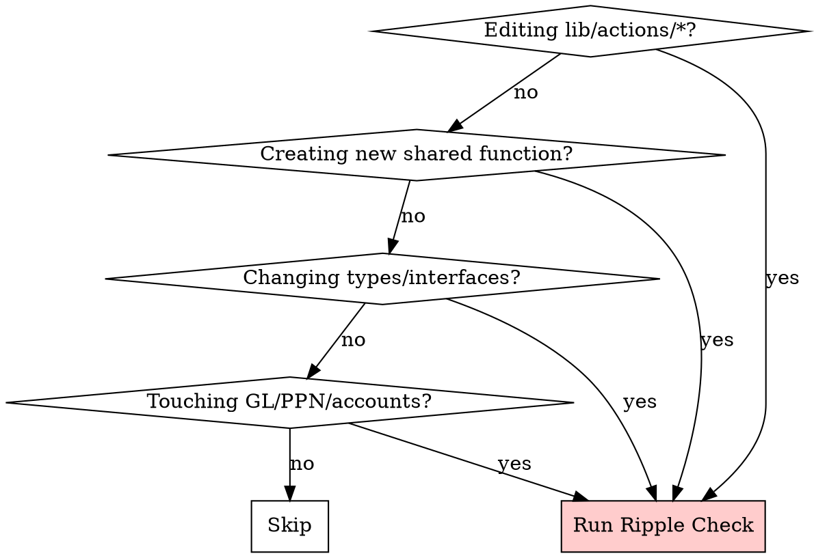

# ERP Ripple Check Skill — Implementation Plan

> **For Claude:** REQUIRED SUB-SKILL: Use superpowers:executing-plans to implement this plan task-by-task.

**Goal:** Create a discipline skill that forces Claude to trace all downstream effects when modifying or creating server actions in the ERP.

**Architecture:** Two-file skill (`SKILL.md` + `erp-dependency-map.md`) installed to `~/.claude/skills/erp-ripple-check/`. Discipline type with hard gates — Claude cannot claim "done" until all 5 phases of the ripple check pass.

**Tech Stack:** Markdown skill files (YAML frontmatter), no code dependencies.

**Design doc:** `docs/plans/2026-03-24-erp-ripple-check-skill-design.md`

---

### Task 1: Create Skill Directory

**Files:**
- Create: `~/.claude/skills/erp-ripple-check/` (directory)

**Step 1: Create the directory**

Run: `mkdir -p ~/.claude/skills/erp-ripple-check`

**Step 2: Verify directory exists**

Run: `ls -la ~/.claude/skills/erp-ripple-check/`
Expected: Empty directory listed

**Step 3: Commit** — N/A (not in git repo)

---

### Task 2: Write erp-dependency-map.md (Supporting Reference)

Write the reference file first — the main SKILL.md will reference it.

**Files:**
- Create: `~/.claude/skills/erp-ripple-check/erp-dependency-map.md`

**Step 1: Write the reference file**

```markdown
# ERP Dependency Map

Reference for the erp-ripple-check skill. Contains ERP-specific knowledge about which files are canonical sources, how GL accounts chain to reports, and known problem areas.

## Finance Action File Map — Canonical Sources

These are the ONLY correct source files for each function. Any copy in `finance.ts` is **stale**.

| Function | Canonical File | Stale Copies In |
|----------|---------------|-----------------|
| `approveVendorBill()` | `lib/actions/finance-ap.ts` | `finance.ts` |
| `recordVendorPayment()` | `lib/actions/finance-ap.ts` | `finance.ts` |
| `getAPAging()` | `lib/actions/finance-ap.ts` | `finance.ts` |
| `createCustomerInvoice()` | `lib/actions/finance-invoices.ts` | `finance.ts` |
| `moveInvoiceToSent()` | `lib/actions/finance-invoices.ts` | `finance.ts` |
| `recordARPayment()` | `lib/actions/finance-ar.ts` | `finance.ts` |
| `getARAgingReport()` | `lib/actions/finance-ar.ts` | `finance.ts` |
| `postJournalEntry()` | `lib/actions/finance-gl.ts` | `finance.ts` |
| `ensureSystemAccounts()` | `lib/actions/finance-gl.ts` | `finance.ts` |
| `getTrialBalance()` | `lib/actions/finance-gl.ts` | `finance.ts` |
| `getBalanceSheet()` | `lib/actions/finance-reports.ts` | `finance.ts` |
| `getProfitLoss()` | `lib/actions/finance-reports.ts` | `finance.ts` |
| `getCashFlowStatement()` | `lib/actions/finance-reports.ts` | `finance.ts` |

**Rule:** If you need a finance function, import from the specialized file. If `finance.ts` still exports it, that export should be a re-export or should be deleted.

## GL Account → Report Page Chain

When a function touches a GL account, these report pages must also be verified:

| Account (SYS_ACCOUNTS.*) | Code | Report Pages Affected |
|--------------------------|------|----------------------|
| `AR` | 1200 | neraca (Current Assets), AR aging, invoice list |
| `AP` | 2000 | neraca (Current Liabilities), AP aging, bill list |
| `BANK_BCA` | 1110 | neraca (Assets), arus-kas, bank reconciliation |
| `REVENUE` | 4000 | laba-rugi (Revenue), invoice details |
| `COGS` | 5000 | laba-rugi (Expense), product costing |
| `EXPENSE_DEFAULT` | 6900 | laba-rugi (Expense), bill details |
| `PPN_MASUKAN` | 1330 | neraca (Assets), tax report |
| `PPN_KELUARAN` | 2110 | neraca (Liabilities), tax report |
| `PETTY_CASH` | 1120 | neraca (Assets), petty cash ledger |

**Rule:** If your function calls `postJournalEntry()` with any of these accounts, check the corresponding report pages still render correctly.

## Module → Action File → Page Mapping

| Module | Action Files | Key Pages |
|--------|-------------|-----------|
| **Sales** | `sales.ts`, `finance-ar.ts`, `finance-invoices.ts` | `app/finance/invoices/page.tsx`, `app/sales/orders/page.tsx` |
| **Procurement** | `procurement.ts`, `finance-ap.ts`, `grn.ts` | `app/finance/bills/page.tsx`, `app/procurement/orders/page.tsx`, `app/finance/vendor-payments/page.tsx` |
| **Finance Core** | `finance-gl.ts`, `finance-reports.ts` | `app/finance/journal/page.tsx`, `app/finance/reports/page.tsx`, `app/finance/chart-accounts/page.tsx` |
| **Manufacturing** | API routes in `app/api/manufacturing/` | `app/manufacturing/orders/page.tsx` |

## Known Problem Areas

Update this section when new issues are discovered.

1. **`finance.ts` monolith** — Contains 37+ stale function copies. Most pages still import from here instead of specialized files. Any function found here should be checked against the canonical file.

2. **PPN blanket fallback** — PPN must ONLY be calculated when `includeTax === true`. Previous bugs applied 11% to everything. Check: does your function use `taxAmount` or `ppnAmount`? Verify it respects the toggle.

3. **GL posting outside Prisma transaction** — If `postJournalEntry()` is called after the main `prisma.$transaction()` commits, a GL failure leaves the document in wrong status. Always post GL inside the transaction or implement rollback.

4. **Hardcoded account codes** — Any string literal like `'1200'`, `'2000'`, `'4000'` in a server action is a bug. Must use `SYS_ACCOUNTS.*` from `lib/gl-accounts.ts`.

5. **Component import mismatch** — Some components import action functions from `@/lib/actions/finance` (the monolith) instead of the specialized file. After any action change, grep for both import paths.

## Grep Patterns for Quick Verification

```bash
# Find all consumers of a function
grep -rn "functionName" --include="*.ts" --include="*.tsx" lib/ app/ components/

# Find duplicate function definitions
grep -rn "export.*async.*function.*functionName" --include="*.ts" lib/actions/

# Find hardcoded account codes (should be zero results)
grep -rn "'[0-9]\{4\}'" --include="*.ts" lib/actions/

# Find imports from finance.ts monolith (migration targets)
grep -rn "from.*lib/actions/finance['\"]" --include="*.ts" --include="*.tsx" app/ components/

# Find all postJournalEntry calls
grep -rn "postJournalEntry" --include="*.ts" lib/actions/
```
```

**Step 2: Review for completeness**

Read the file back and verify:
- All canonical file mappings match actual exports in the codebase
- GL account codes match `lib/gl-accounts.ts`
- Module mappings cover all active modules

Run: `cat ~/.claude/skills/erp-ripple-check/erp-dependency-map.md | wc -l`
Expected: ~100-120 lines

---

### Task 3: Write SKILL.md (Main Discipline Skill)

**Files:**
- Create: `~/.claude/skills/erp-ripple-check/SKILL.md`

**Step 1: Write the skill file**

```markdown
---
name: erp-ripple-check
description: Use when modifying or creating any server action, shared function, or type in the ERP — especially lib/actions/, lib/gl-accounts.ts, or files imported by multiple pages. Also use when fixing bugs in shared code, changing function signatures, or touching GL posting logic.
---

# ERP Ripple Check

## Overview

Trace all downstream effects before claiming a change is done.

**Core principle:** If you changed a function but didn't verify every consumer, you shipped a bug you haven't found yet.

**Violating the letter of these rules is violating the spirit.**

## When to Use



**Do NOT use when:**
- Editing UI-only code (styling, layout) with no action/type changes
- Editing a self-contained component with no shared imports
- Documentation-only changes

## The 5-Phase Protocol

<HARD-GATE>
You CANNOT mark a task as complete, claim you are done, or move on until ALL 5 phases pass. No exceptions. No "I'll check later." Check NOW.
</HARD-GATE>

### Phase 1: DUPLICATE SCAN

**Before writing any code**, search for the function name across the codebase.

```bash
# Find duplicate definitions
grep -rn "export.*async.*function.*FUNCTION_NAME" --include="*.ts" lib/actions/
grep -rn "export.*function.*FUNCTION_NAME" --include="*.ts" lib/actions/
```

- If found in multiple files → **STOP**. Determine which is canonical (see erp-dependency-map.md).
- Delete or replace the stale copy with a re-export BEFORE proceeding.
- If creating a new function, verify no existing function does the same thing.

**Gate:** No duplicate definitions exist (or stale copies deleted/flagged to user).

### Phase 2: CONSUMER TRACE

Find every file that imports or calls the function.

```bash
# Find all imports
grep -rn "FUNCTION_NAME" --include="*.ts" --include="*.tsx" app/ components/ lib/
```

Build the consumer list. Every file in this list must be verified in Phase 5.

**Gate:** Consumer list is complete. You can name every file.

### Phase 3: GL IMPACT TRACE

**Only for functions that touch financial data.** Skip if the function has no GL, invoice, bill, payment, or account interaction.

Check:
- Which `SYS_ACCOUNTS.*` constants does it reference? (see erp-dependency-map.md for account→report chain)
- Does `postJournalEntry()` produce balanced entries? (`SUM(debit) === SUM(credit)`)
- Is PPN separated? (DPP to Revenue/Expense, PPN to PPN_MASUKAN/KELUARAN)
- Which report pages query the affected accounts?

**Gate:** GL entries balance. PPN is separated. Report pages identified.

### Phase 4: TYPE & INTERFACE CHECK

If the function signature changed (new params, different return type, renamed fields):

- Find all TypeScript interfaces/types that reference this function's input/output
- Find all Zod schemas that validate its data
- Update ALL of them consistently

If no signature change, verify the behavioral change doesn't break consumer assumptions.

**Gate:** All types/interfaces/schemas consistent with new signature.

### Phase 5: CONSUMER VERIFICATION

For EACH consumer from Phase 2:

- Does it import from the **canonical** file? (not a stale copy — check erp-dependency-map.md)
- Does it pass correct arguments? (matches current signature)
- If it displays data affected by the change, does the display still work?
- If it's a finance page, does the data path from GL→report still work?

**Gate:** Every consumer verified. Zero broken imports.

## Output Format

After completing all 5 phases, output this summary:

```
## Ripple Check Complete ✅
- **Function:** functionName()
- **File:** lib/actions/canonical-file.ts
- **Duplicates:** N found (deleted/flagged)
- **Consumers:** N/N verified
  ✅ app/path/page.tsx — correct import, args match
  ✅ components/path/component.tsx — correct import, args match
- **GL impact:** [accounts touched] → [reports verified] (or "N/A — no GL impact")
- **Types:** [changes made] (or "No signature change")
```

If ANY phase fails and you cannot fix it, output:

```
## Ripple Check INCOMPLETE ⚠️
- **Blocked at:** Phase N
- **Issue:** [what's wrong]
- **Action needed:** [what the user must decide]
```

## Anti-Rationalization Table

| Claude thinks... | Reality |
|---|---|
| "I only changed one line" | One-line bugs have caused production issues in this ERP. Check anyway. |
| "This function is only used in one place" | Prove it. Grep first. Finance module has 37 duplicates you didn't know about. |
| "Types haven't changed, consumers are fine" | Behavior change without type change is the hardest bug to catch. Verify. |
| "I'll check consumers after I finish" | No. Check BEFORE. Consumer issues may require changing your implementation. |
| "Not a finance function, skip GL trace" | If it touches ANY model with GL relationship (Invoice, Payment, Bill, PO), Phase 3 applies. |
| "The duplicate is dead code" | Prove it. If nothing imports it, delete it. If something does, it's a live bug. |
| "I already know all the consumers" | You don't. Run the grep. Trust the search, not your memory. |
| "This is an internal helper, nobody else uses it" | Grep anyway. Helpers get imported. 30 seconds to verify vs hours debugging. |
| "I'll clean up the duplicate later" | No. Clean it up NOW. "Later" means "never" and the next developer hits the stale version. |
| "The consumer only uses one field, my change doesn't affect it" | You don't know what the consumer does with that field downstream. Verify the full path. |

## Red Flags — STOP Immediately

- Creating a new function in `finance.ts` instead of the specialized file
- Hardcoding an account code as string literal (`'1200'`, `'2000'`)
- Modified a function but haven't grepped for consumers
- Changing a function signature without updating Zod schemas
- Found a duplicate and thinking "I'll clean it up later"
- About to claim "done" without outputting the Ripple Check summary
- Skipping Phase 3 for a function that calls `postJournalEntry()`
- Consumer imports from `lib/actions/finance` instead of specialized file — migration required

**All of these mean: STOP. Fix the issue. Then continue.**

## Integration with Other Skills

- **verification-before-completion**: Ripple check is part of verification. Run it before claiming done.
- **systematic-debugging**: When tracing a bug, ripple check reveals all affected code paths.
- **test-driven-development**: After ripple check, any new consumer path needs a test.
- **Accounting audit SOP** (CLAUDE.md): Audit checks accounting correctness; ripple check ensures code consistency. Both are required for finance changes.

## Quick Reference

| Phase | What | Gate |
|-------|------|------|
| 1. Duplicate Scan | Grep function name across codebase | No stale copies |
| 2. Consumer Trace | Find all importers | Complete list |
| 3. GL Impact | Trace account→report chain | Entries balanced |
| 4. Type Check | Interfaces + Zod schemas | All consistent |
| 5. Consumer Verify | Check each importer works | Zero broken |
```

**Step 2: Verify file size**

Run: `wc -w ~/.claude/skills/erp-ripple-check/SKILL.md`
Expected: ~800-1000 words (reasonable for a discipline skill with reference table)

**Step 3: Verify frontmatter**

Run: `head -4 ~/.claude/skills/erp-ripple-check/SKILL.md`
Expected:
```
---
name: erp-ripple-check
description: Use when modifying or creating any server action...
---
```

---

### Task 4: Verify Skill Discovery

**Step 1: Check that Claude Code can find the skill**

Run: `ls -la ~/.claude/skills/erp-ripple-check/`
Expected: Both `SKILL.md` and `erp-dependency-map.md` listed

**Step 2: Verify YAML frontmatter is valid**

Run: `head -5 ~/.claude/skills/erp-ripple-check/SKILL.md`
Expected: Valid YAML between `---` markers, name and description fields only

**Step 3: Verify description length**

Run: `sed -n '3p' ~/.claude/skills/erp-ripple-check/SKILL.md | wc -c`
Expected: Under 500 characters

---

### Task 5: Baseline Test (RED) — Run Pressure Scenario Without Skill

Per the writing-skills TDD process, we must see Claude fail WITHOUT the skill first.

**Step 1: Design a pressure scenario**

Create a test prompt that asks Claude to modify `approveVendorBill()` in `finance-ap.ts` — a function known to have a stale copy in `finance.ts` and multiple page consumers. The correct behavior is to check for duplicates and verify all consumers. Without the skill, Claude will likely just edit the function and move on.

**Step 2: Run in a subagent WITHOUT the skill loaded**

Dispatch a subagent with this prompt:
> "Modify `approveVendorBill()` in `lib/actions/finance-ap.ts` to add a `notes` parameter. Make it work."

Observe: Does the subagent check for duplicates? Does it find consumers? Does it verify GL impact?

**Step 3: Document baseline behavior**

Record exactly what the subagent did and didn't do:
- Did it grep for duplicates? (expected: NO)
- Did it find all consumers? (expected: NO or incomplete)
- Did it check GL impact? (expected: NO)
- What rationalizations did it use to skip checks?

---

### Task 6: Green Test — Run Same Scenario WITH Skill

**Step 1: Ensure skill is loaded**

Verify `~/.claude/skills/erp-ripple-check/SKILL.md` exists and will be discovered.

**Step 2: Run same pressure scenario with skill present**

Dispatch a subagent with same prompt:
> "Modify `approveVendorBill()` in `lib/actions/finance-ap.ts` to add a `notes` parameter. Make it work."

Observe: Does it now follow the 5-phase protocol?

**Step 3: Verify compliance**

- Phase 1 (Duplicate Scan): Did it grep and find the `finance.ts` copy?
- Phase 2 (Consumer Trace): Did it find all importing pages/components?
- Phase 3 (GL Impact): Did it verify journal entry balance?
- Phase 4 (Type Check): Did it update interfaces?
- Phase 5 (Consumer Verify): Did it check each consumer?
- Output: Did it produce the Ripple Check summary?

**Step 4: If any phase was skipped**

Identify the rationalization → add it to the anti-rationalization table → re-test.

---

### Task 7: Refactor — Close Loopholes

**Step 1: Run 2 more pressure scenarios**

Scenario A — Creating a new function:
> "Create a new `recordPartialPayment()` function in the finance module."

Watch for: Does it check if similar functions exist? Does it choose the right canonical file?

Scenario B — Bug fix with minimal change:
> "Fix: `moveInvoiceToSent()` doesn't include tax in the GL entry amount. Quick fix."

Watch for: Does it resist "quick fix" pressure and still run the full ripple check?

**Step 2: Update skill with any new rationalizations found**

Add new entries to anti-rationalization table.
Add new red flags if discovered.

**Step 3: Final verification**

Re-run all 3 scenarios and confirm 100% compliance.

---

### Task 8: Commit and Document

**Step 1: Verify final file state**

Run: `ls -la ~/.claude/skills/erp-ripple-check/`
Expected: `SKILL.md` and `erp-dependency-map.md`

Run: `wc -w ~/.claude/skills/erp-ripple-check/SKILL.md`
Expected: Under 1200 words

Run: `wc -w ~/.claude/skills/erp-ripple-check/erp-dependency-map.md`
Expected: Under 500 words

**Step 2: Commit the design doc in the ERP repo**

```bash
cd "/Volumes/Extreme SSD/ERP-System/erp-system"
git add docs/plans/2026-03-24-erp-ripple-check-skill-design.md docs/plans/2026-03-24-erp-ripple-check-skill.md
git commit -m "docs: add erp-ripple-check skill design and implementation plan"
```

**Step 3: Announce completion**

Tell the user the skill is installed and provide usage instructions:
- Skill triggers automatically when editing `lib/actions/` or shared functions
- Can be manually invoked by referencing `erp-ripple-check` in conversation
- Reference file can be updated as ERP evolves
