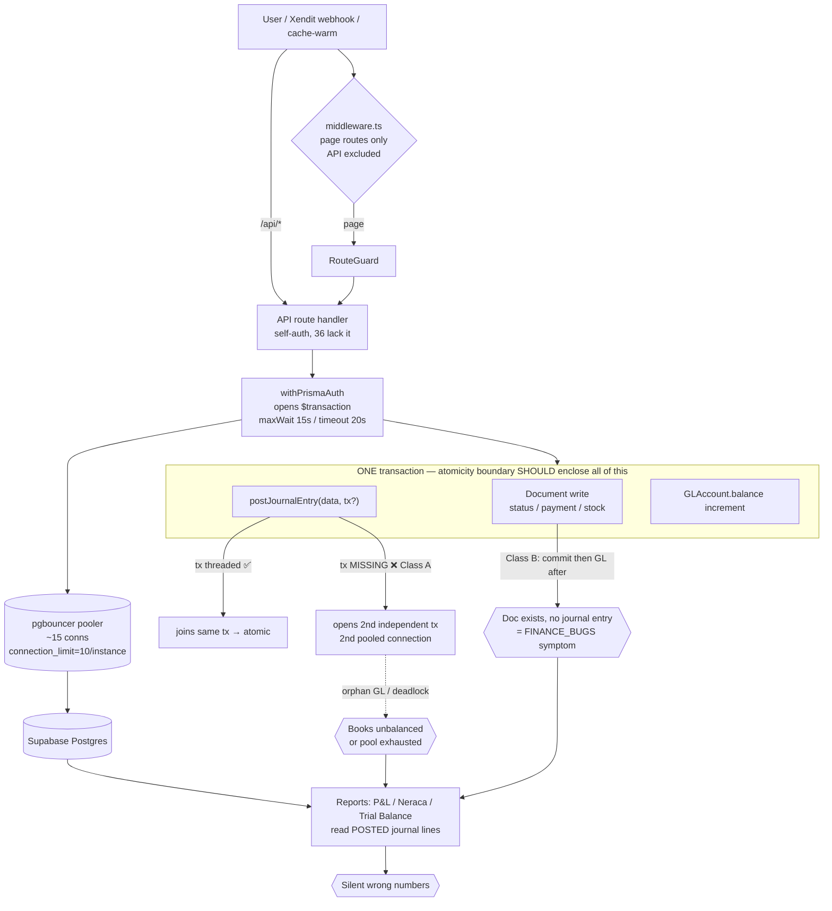

# FAILURE MODES (FMEA) — Phase A Reliability Audit

> FMEA-style analysis of how this ERP fails in production. Companion to `RELIABILITY_FINDINGS.md` and
> `RELIABILITY_INVENTORY.md`. Read-only static analysis, 2026-07-25.
>
> **Scoring** (1–5): **L** = Likelihood, **I** = Impact, **D** = Difficulty-to-detect (5 = nearly invisible).
> **RPN** = L × I × D (max 125). Higher = fix sooner. Detectability is deliberately weighted — for an
> accounting system, a *silent* wrong number (high D) is worse than a loud crash.

## Request → pooled-DB → transaction → GL path (where atomicity boundaries must sit)

The single most important structural fact: **the atomicity boundary must enclose the document write, the GL
post, and the balance update together.** Class A breaks it by opening a second transaction for GL; Class B
breaks it by posting GL after the first transaction commits. Both surface downstream as wrong reports.

---

## FMEA table (ranked by RPN)

| # | Failure mode | Trigger | Effect (what the user sees) | L | I | D | RPN | Current mitigation | Recommended | Finding |
|---|--------------|---------|-----------------------------|---|---|---|-----|--------------------|-------------|---------|
| 1 | **Document committed, GL missing/orphaned** | AP payment / payroll / depreciation / sales return under partial failure or load (Class A/B) | Books unbalanced; COA/P&L/Neraca silently wrong; "invoice sent but not in AR" | 4 | 5 | 5 | **100** | Canonical files atomic; but UI wires to non-atomic `finance.ts` | Thread tx into every GL post; consolidate onto canonical; add runtime trial-balance check | R-01, R-02 |
| 2 | **DB outage renders as Rp 0 / empty, HTTP 200** | Any DB error on a read/dashboard | CEO sees Rp 0 revenue/profit; POs/vendors "gone"; no error shown | 3 | 5 | 5 | **75** | none (fallbacks are the bug) | Distinguish loaded-0 from failed-load; surface errors; health check | R-06, R-08, R-09 |
| 3 | **Connection-pool exhaustion / deadlock** | Concurrent cold starts + dashboard nested fan-out + 20s interactive txns @ limit 10 | Requests hang then 500; app "down" under modest load | 4 | 4 | 4 | **64** | `withRetry` on P1001/2/8/2024; per-branch `withTimeout` | Don't wrap reads in txns; verify pool size/pgbouncer; set maxDuration; cache | R-05, R-27 |
| 4 | **Duplicate government tax serial (NSFP)** | Two faktur issued concurrently | Two invoices share one legal NSFP number; tax-compliance defect | 3 | 5 | 4 | **60** | none | Atomic `{increment}` + `@unique` on nsfpNumber | R-03 |
| 5 | **Negative stock** | Concurrent WO start / subcontract send / reservation | Stock < 0; availableQty desync; ledger ≠ levels | 4 | 4 | 3 | **48** | `gte` guard on *some* paths only; no DB CHECK | Add gte guard to all decrements + CHECK constraint | R-04, R-13 |
| 6 | **Webhook double-processing / lost update** | Xendit redelivers same event; or DB error | Duplicate side-effects; or a paid invoice's balanceDue silently zeroed; lost status (no retry) | 4 | 4 | 4 | **64** | racy `notes` string scan; idempotency-key only outbound | Unique processed-event row in the state-change tx; post GL; return non-2xx on failure | R-07 |
| 7 | **Act on stale financial data** | View AR/invoice; payment posts elsewhere; 5-min staleTime + IndexedDB offlineFirst | Duplicate payment recorded; settled customer chased | 3 | 4 | 4 | **48** | short-tier comment (undefined) | Zero/short staleTime + refetchOnFocus for money queries | R-11 |
| 8 | **cache-warm stampede / self-DoS** | Many users prefetch; or attacker POSTs large keys[] | DB storm; latency spike; possible outage | 3 | 4 | 3 | **36** | none (unauth, caches nothing) | Auth + real caching + lock/dedupe | R-10 |
| 9 | **Slow report / traceability query** | GL volume grows; invoice→GL / PO-lines / inventory-trace joins seq-scan | Timeouts on reports & PO pages; holds connections | 4 | 3 | 3 | **36** | none | Add `@@index` on hot FK columns | R-12 |
| 10 | **Concurrent double status transition** | Two users transition same PO/SO | Lost update; illegal state (Confirm+Cancel both win) | 2 | 4 | 4 | **32** | guard on `approvePO` only | `where:{id,status:current}`+count on all transitions | R-16 |
| 11 | **Ledger ≠ stock levels (type mismatch)** | Fractional fabric receipt (2.5m) | Movement ledger truncates to Int; won't reconcile | 3 | 3 | 4 | **36** | none | Make InventoryTransaction.quantity Decimal | R-13 |
| 12 | **Type regression ships to prod** | Wrong field after schema change; `ignoreBuildErrors` | Runtime crash / wrong data on a page that "built fine" | 3 | 3 | 3 | **27** | none (build gate off) | `tsc --noEmit` in CI | R-23 |
| 13 | **Unbounded external call hangs function** | Xendit/Typst/Excel slow or large input | Function holds slot (+DB conn) to platform max; timeout | 3 | 3 | 3 | **27** | middleware getUser 5s race only | Timeouts + maxDuration; move Excel off request path | R-15 |
| 14 | **Unauthenticated mutating API route** | Direct call to `/api/system/fix-cn-partial` etc. | Data mutated without auth | 2 | 4 | 3 | **24** | middleware excludes /api | Add auth to all 36 routes | R-14 |
| 15 | **Duplicate document number 500s** | Concurrent create where `@unique` exists | Spurious 500/409; user retries | 3 | 2 | 2 | **12** | `@unique` prevents corruption | Route numbering via DocumentCounter upsert | R-17 |
| 16 | **Migration aborts / data loss** | Deploy `credit_notes` drop or partial-unique index with dupes | Half-migrated DB; lost rows | 2 | 4 | 2 | **16** | none (manual rollback only) | Pre-consolidate; data-migration before drop | R-25, R-26 |
| 17 | **Invisible production errors** | Any error | No alert; found only when a user complains | 4 | 3 | 4 | **48** | 799 raw console.* | Sentry + structured logger + /api/health | R-21 |
| 18 | **WO completion leaves no GL** | Work order completed | Finished-goods/COGS valuation drifts | 3 | 4 | 4 | **48** | none (TBD) | Implement atomic WO-completion GL | R-18 |

---

## The three failure archetypes (mental model)

1. **Silent-wrong-data (highest D).** Non-atomic GL (#1), zeroed fallbacks (#2), stale cache (#7), missing WO
   GL (#18), duplicate NSFP (#4). These don't crash — they quietly corrupt the numbers a business runs on.
   *Detection is the fix multiplier:* a runtime trial-balance + orphan-JE invariant check (R-22) would make
   most of these loud instead of silent.
2. **Availability-under-load.** Pool exhaustion (#3), cache-warm stampede (#8), slow un-indexed queries (#9),
   unbounded external calls (#13). All trace back to the interactive-transaction + no-caching + no-timeout
   design against a small pooler.
3. **Concurrency corruption.** Negative stock (#5), webhook double-process (#6), double transitions (#10),
   duplicate serials (#4/#15). The codebase has the right primitive (atomic guarded `updateMany`, unique
   upsert) — it's applied inconsistently.

## Recommended detection layer (turns silent → loud)

Add a protected `/api/admin/integrity-check` (and `/api/health` for probes) asserting, on a schedule:
- `SUM(JournalLine.debit) == SUM(JournalLine.credit)` (global trial balance)
- every `Invoice` in ISSUED/PAID has ≥1 linked **POSTED** `JournalEntry` (catches #1/#18)
- every `GLAccount.balance` == sum of its posted lines (catches denormalized-cache drift)
- `StockLevel` per (product,warehouse,location) == running sum of `InventoryTransaction` (catches #5/#11)

These queries need the R-12 indexes to run fast enough to schedule — so **add the indexes first**, then the
checks, then work down the FMEA by RPN.
