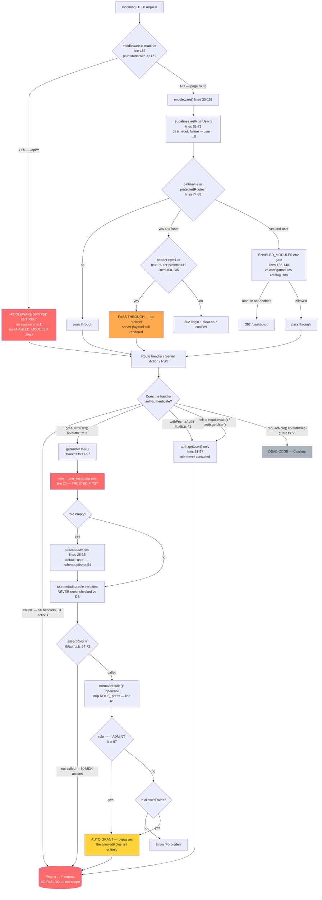

# AUTH_MODEL — Reconstructed Authentication, Authorization & Tenancy Model

> **Phase A security audit, READ-ONLY.** This document describes the system **as it is**, not as it should be.
> Companion file: [`SECURITY_ROUTE_AUTH_INVENTORY.md`](./SECURITY_ROUTE_AUTH_INVENTORY.md) — the exhaustive per-endpoint matrix.
> Every claim below cites `path:line`. Claims that cannot be settled from the repository are marked **UNVERIFIED**.

---

## 0. Executive summary

| Question | Answer |
|---|---|
| Is there an auth gateway for `/api/*`? | **No.** `middleware.ts:167` excludes `api/` from the matcher. |
| How many API handlers have **zero** authentication? | **56 of 215** (26%), across 36 route files. |
| How many API handlers perform a **role** check? | **0 of 215.** |
| How many exported server actions have **zero** authentication? | **31 of 534.** |
| How many exported server actions perform a **role** check? | **30 of 534** (5.6%) — all in `procurement.ts`, `grn.ts`, `hcm.ts`, `documents-system.ts`. |
| Role source of truth | Supabase `user_metadata.role` (`lib/authz.ts:19-20`) — **client-supplied at signup** (`app/signup/page.tsx:60-67`). |
| Tenant isolation in the data layer | **None.** 0 of 126 Prisma models carry a tenant/company/org FK; no RLS policies exist. |
| Two authz systems reconciled? | No — `lib/auth/role-guard.ts` has **zero consumers** (dead code); `lib/authz.ts` is the only live one. |

---

## 1. Request lifecycle



### 1.1 What the middleware actually protects

`middleware.ts:74-89` lists 14 protected **page** prefixes (`/dashboard`, `/inventory`, `/finance`, `/hcm`, `/sales`, `/procurement`, `/manufacturing`, `/hr`, `/accountant`, `/manager`, `/staff`, `/subcontract`, `/cutting`, `/costing`).

It performs **authentication only** — it never reads a role. The only authorization it applies is the `ENABLED_MODULES` module gate (`middleware.ts:133-148`), which is a *tenant plan* gate, not a *user permission* gate: it is identical for every user in the container.

Two structural gaps in the middleware itself:

1. **`api/` is excluded** (`middleware.ts:167`). Stated rationale in the comment is token-refresh race conditions. Consequence: 160 route files must each self-authenticate, and 36 of them do not.
2. **RSC/prefetch bypass** (`middleware.ts:100-105`): when `rsc: 1` or `next-router-prefetch: 1` is present, an unauthenticated request to a protected page is **not** redirected. Server components on that route still execute and their serialized payload is returned. Any server component that fetches data without its own auth check leaks through this path. Enforcement is delegated to `components/route-guard.tsx`, which is client-side only (see §5).

---

## 2. The two authorization systems

| | `lib/authz.ts` | `lib/auth/role-guard.ts` |
|---|---|---|
| Entry point | `getAuthzUser()` :11 | `getCurrentUserRole()` :8, `requireUser()` :48, `requireRole()` :56 |
| Role type | `role: string` — **unconstrained** (`AuthzUser`, :4-9) | `type UserRole = "admin" \| "user" \| "manager" \| "CEO" \| "DIRECTOR" \| "PURCHASING" \| "WAREHOUSE"` (:5) |
| Prisma import | `@/lib/prisma` (:2) | `@/lib/db` (:2) |
| Role resolution | metadata first (:20), DB fallback only when empty (:24-35), default `ROLE_STAFF` (:49) | metadata first (:19), DB fallback (:24-32), default `ROLE_STAFF` (:34) |
| Normalization | uppercase **and strip `ROLE_`** (:60-62) | uppercase **only** (:63) |
| Admin auto-grant | `userRole === 'ADMIN'` (:67) — after prefix strip, so `ROLE_ADMIN` *and* `ADMIN` both hit | `=== 'ADMIN' \|\| === 'ROLE_ADMIN'` (:66) |
| Failure mode | `throw new Error("Unauthorized" / "Forbidden")` | `throw` / `return null` |
| **Live consumers** | **11 files** | **0 files** |

### 2.1 Divergences

- **D1 — Role vocabulary is incompatible.** `role-guard.ts:5` declares a 7-value union (`"admin"`, `"user"`, `"manager"`, `"CEO"`, `"DIRECTOR"`, `"PURCHASING"`, `"WAREHOUSE"`). Every value actually used in the codebase is `ROLE_`-prefixed: `ROLE_ADMIN`, `ROLE_CEO`, `ROLE_DIRECTOR`, `ROLE_MANAGER`, `ROLE_PURCHASING`, `ROLE_ACCOUNTANT`, `ROLE_SALES`, `ROLE_STAFF`, `ROLE_WAREHOUSE` (`lib/actions/procurement.ts:37-39`, `lib/actions/grn.ts:19`, `app/actions/documents-system.ts:8`, `lib/employee-context.ts:14`, `app/signup/page.tsx:14-18`). Because `role-guard.requireRole()` only uppercases and does **not** strip the prefix (:63), a `ROLE_MANAGER` user would fail `requireRole(["manager"])`. Latent, but currently harmless — see D2.
- **D2 — `role-guard.ts` is dead code.** A repo-wide grep for `requireRole|requireUser|getCurrentUserRole|role-guard` returns matches only inside `lib/auth/role-guard.ts` itself. It is a decoy: it looks like the authorization layer and enforces nothing. Its existence makes the codebase read as more protected than it is.
- **D3 — A third de-facto system exists.** `lib/db.ts:41-57` `withPrismaAuth()` is the most widely used gate (372 call sites across 39 action files). It performs `supabase.auth.getUser()` and throws `'Not authenticated'` — it is **authentication only** and never looks at a role. Its name reads as an authorization wrapper, which likely explains why 504 of 534 server actions carry no role check.
- **D4 — A fourth partial system.** `lib/employee-context.ts` provides `isSuperRole()` (:23, super set = `ROLE_ADMIN|ROLE_CEO|ROLE_DIRECTOR|ADMIN|CEO|DIRECTOR`) plus **position-string keyword matching** (`isManagerPosition()` :26 matches on substrings `manager|head|supervisor|lead|director|ceo` in the `Employee.position` free-text field). Used in `lib/actions/tasks.ts`, `lib/actions/procurement.ts`, `lib/actions/stock-transfers.ts`, `app/api/tasks/manager/route.ts:15`. Authorization derived from an unvalidated free-text field is a distinct weakness from role-based authz.
- **D5 — Inline duplicates.** At least 6 route files define their own `requireAuth()` (`app/api/sales/customers/route.ts:8-13`, `app/api/sales/customers/[id]/route.ts:23`, `app/api/sales/leads/[id]/route.ts:7`, `app/api/sales/orders/[id]/route.ts:5`, `app/api/sales/orders/[id]/transition/route.ts:5`, `app/api/sales/quotations/[id]/route.ts:6`), and 20+ action files define a local `requireAuth()`. All are authentication-only.

### 2.2 ADMIN auto-grant blast radius

`assertRole()` (`lib/authz.ts:64-72`) is the **only** live role gate, used at exactly 30 call sites. Its `userRole === 'ADMIN'` short-circuit (:67) fires **after** `ROLE_` stripping (:61), so both `ADMIN` and `ROLE_ADMIN` bypass the `allowedRoles` argument entirely at all 30 sites:

| Role set | Definition | Guarded operations |
|---|---|---|
| `PURCHASING_ROLES` | `procurement.ts:37` | PO create-from-PR, submit, mark ordered/confirmed/shipped, change vendor, change tax mode, update/deactivate vendor, direct purchase (13 sites) |
| `APPROVER_ROLES` | `procurement.ts:38` | `approvePurchaseOrder`, `rejectPurchaseOrder` (2 sites) |
| `PR_APPROVER_ROLES` | `procurement.ts:39` | `approvePurchaseRequest`, `rejectPurchaseRequest` (2 sites) |
| `RECEIVING_ROLES` | `grn.ts:19` | `createGRN`, `acceptGRN`, `rejectGRN` (3 sites) — GRN acceptance moves stock and posts GL |
| `SDM_APPROVER_ROLES` | `hcm.ts:28` | leave approve/reject, payroll draft/approve/disbursement batch (5 sites) |
| `DOCUMENTS_ADMIN_ROLES` | `documents-system.ts:8` | category/warehouse/system-role CRUD, **`updateRolePermissionsFromDocuments`** (7 sites) |

Because ADMIN is auto-granted, holding `ADMIN` collapses all six sets into one. The last row is self-amplifying: `updateRolePermissionsFromDocuments` (`documents-system.ts:922`) rewrites `SystemRole.permissions`, which is the input to `getActiveModulesForCurrentUser()` (`documents-system.ts:647-706`) — the source of the client-side permission list.

---

## 3. Role source of truth — and its mutability

### 3.1 The chain

```
supabase.auth.getUser()  →  user.user_metadata.role   ← PRIMARY  (lib/authz.ts:19-20)
                              ↓ only if empty string
                         prisma.user.role             ← FALLBACK (lib/authz.ts:26-35)
                              ↓ only if still empty
                         "ROLE_STAFF"                 ← DEFAULT  (lib/authz.ts:49)
```

The metadata value is **never validated against the database**. `lib/authz.ts:24` gates the DB lookup on `if (!role || !employeeId)`, and `:34` re-checks `if (!role)` — so a non-empty metadata role is always used verbatim.

The DB fallback is also structurally weak: `prisma/schema.prisma:54` declares `role String @default("user")` with a comment `// admin, user, manager`. A DB-sourced role is therefore `"user"` — which after `normalizeRole()` is `"USER"`, matching **none** of the `ROLE_*` sets used anywhere in the app. The database is not a usable authority for roles today; metadata is the only functional source.

### 3.2 Is it client-mutable? — **CONFIRMED YES**

`app/signup/page.tsx:58-68`:

```
const { error } = await supabase.auth.signUp({
    email, password,
    options: { data: { name: fullName, role: role }, ... }
})
```

The `role` is taken from client component state (`app/signup/page.tsx:28`, bound to a `<select>` at :210-213) and written straight into `user_metadata`. The `<select>` offers `ROLE_CEO | ROLE_MANAGER | ROLE_ACCOUNTANT | ROLE_SALES | ROLE_STAFF` (`app/signup/page.tsx:14-18`), but that list is a **UI affordance, not a control** — `signUp` is a direct call from the browser to Supabase's `/auth/v1/signup` using the public anon key (`lib/supabase/client.ts:3-8`), so the attacker chooses the value. `role: "ROLE_ADMIN"` or `role: "ADMIN"` is accepted with no server-side mediation. `app/auth/callback/route.ts:30` simply exchanges the code for a session; it never inspects or rewrites the role. There is **no** server action, database trigger, or `auth.admin` call anywhere in the repository that overwrites `user_metadata.role` after signup.

**Even the sanctioned dropdown values are an escalation**: `ROLE_CEO` is in `APPROVER_ROLES`, `PR_APPROVER_ROLES`, `RECEIVING_ROLES`, `SDM_APPROVER_ROLES` and `DOCUMENTS_ADMIN_ROLES` — a self-registered "Owner / CEO" passes every live role gate in the system.

### 3.3 The `updateUser` question — **UNVERIFIED (repo) / by-design (Supabase)**

The task asks whether an authenticated user can rewrite their own `user_metadata.role` via `supabase.auth.updateUser({ data: { role } })`.

- **Repo evidence:** no `updateUser` call exists anywhere in `app/`, `lib/`, or `components/` (grep: only `signUp` at `app/signup/page.tsx:58` and reads at `lib/authz.ts:19`, `lib/auth/role-guard.ts:18`, `lib/auth-context.tsx:187-195`, `app/login/page.tsx:88`). The application does not itself expose this.
- **Platform behaviour:** Supabase GoTrue's `PUT /auth/v1/user` writes `raw_user_meta_data` on behalf of the caller's own JWT, and `user_metadata` is documented as user-writable and *not* to be used for authorization. The browser holds the anon key (`lib/supabase/client.ts:5`) and a session JWT, so the call is available to any logged-in user regardless of what the app's own code does.
- **Verdict:** the signup vector (§3.2) is **CONFIRMED from the repository alone** and is sufficient on its own. Whether an *already-provisioned* account can additionally self-promote via `updateUser` depends on the Supabase project's GoTrue configuration and any `auth.users` triggers, which are **not in this repository** → **UNVERIFIED**. It should be treated as true until the project config is inspected.

---

## 4. Tenant isolation

**There is no data-layer tenant isolation.**

| Control | Present? | Evidence |
|---|---|---|
| `tenantId` / `companyId` / `orgId` column on business models | **No** | grep over `prisma/schema.prisma` (126 models): zero matches. The only tenant construct is `model TenantConfig` (:99-113), a **singleton config row** keyed by `tenantSlug`, with no relation to any other model. |
| Postgres Row Level Security | **No** | zero `CREATE POLICY` / `ENABLE ROW LEVEL SECURITY` in `prisma/migrations/**` or any `.sql` in the repo. |
| RLS via Supabase JWT claims | **No** — explicitly disclaimed | `lib/db.ts:49-50`: *"Since RLS is bypassed (postgres user has full access), we only need to verify the user is authenticated, not pass JWT claims."* Prisma connects as a privileged role over `DATABASE_URL`; no JWT is forwarded. |
| Query-level scoping | **No** | no Prisma `where` clause anywhere filters by tenant/company/org. |

The tenancy model is therefore **container-per-tenant**: each deployment gets its own database, its own `TENANT_SLUG`, and its own `ENABLED_MODULES` (`middleware.ts:15-19`). Isolation is entirely an infrastructure property.

Two consequences:

1. **`ENABLED_MODULES` is a plan/licensing gate, not a security boundary.** It applies only to page routes (`middleware.ts:133-148`); `/api/**` is excluded by the matcher (:167). Every disabled module's data remains fully reachable through its API routes and server actions — e.g. `ENABLED_MODULES` without `FINANCE` still leaves `/api/finance/*` (33 route files) and all of `lib/actions/finance-*.ts` live. `getActiveModulesForCurrentUser()` (`app/actions/documents-system.ts:647`) likewise only *reports* the permission list to the client for UI purposes; nothing consumes it as an enforcement point.
2. **If the single-tenant-per-container assumption is ever broken** — one deployment serving two customers, a shared staging DB, a shared pooler — there is no second line of defence. Every authenticated user reaches every row. Flagging **CRITICAL conditional on deployment topology**; the topology itself is **UNVERIFIED** from the repo (no IaC, no Dockerfile-per-tenant manifest present).

---

## 5. Client-trust boundary

Authorization decisions made **only in the browser**, with no server counterpart:

| Client control | Location | Server counterpart |
|---|---|---|
| `ROLE_PERMISSIONS` route map; per-role `router.replace()` for STAFF / ACCOUNTANT / PURCHASING / WAREHOUSE / MANAGER; global access for CEO / ADMIN / DIRECTOR | `components/route-guard.tsx:8-13, 44-110` | **None.** Middleware checks authentication and `ENABLED_MODULES` only; no route handler checks a role. |
| `user.role` used for all of the above | `lib/auth-context.tsx:186-190` — reads `authUser.user_metadata?.role`, else defaults `ROLE_STAFF` | Same untrusted metadata field (`lib/authz.ts:20`). |
| Post-login landing route per role | `app/login/page.tsx:88-100` | none |
| `homePath` per role | `lib/auth-context.tsx:~223-231` | none |
| `canManage` flag returned to the client to show/hide document-admin UI | `app/api/documents/overview/route.ts:275` (`DOCUMENTS_ADMIN_ROLES.includes(authUser.role)`) | Advisory only — the route itself has no role gate. The corresponding *mutations* in `app/actions/documents-system.ts:711-925` **are** gated, so this one is UI-hiding backed by real enforcement. |
| Role/permission matrix editor UI | `app/api/settings/permissions-data/route.ts:22-23` | Authenticated, **no role gate**. |

`components/route-guard.tsx:51` carries the comment *"server remains source of truth"*. As of this audit that is not accurate for role-based access: no server-side role check exists on any API route, and only 30 of 534 server actions have one. Every RouteGuard redirect is defeated by calling the underlying route or action directly.

Note also that `lib/auth-context.tsx:155-157` contains `// TEMPORARY: If email is 'ceo@erp.com' -> CEO` and `// Mocking fetching role from DB based on auth ID` — the role plumbing is still at prototype fidelity.

---

## 6. Recommended single source of truth

The remediation is Phase B work; this section records the target design so the inventory can be triaged against it.

1. **Delete `lib/auth/role-guard.ts`.** Zero consumers; its only effect is to make the codebase look guarded.
2. **Make the database the sole role authority.** Add a `UserRole` enum to `prisma/schema.prisma` (replacing `role String @default("user")` at :54, whose default matches nothing), and change `lib/authz.ts:19-49` to read `prisma.user.role` **first**, treating `user_metadata.role` as a non-authoritative hint or ignoring it entirely. A DB-sourced role cannot be set by a `signUp` payload.
3. **Close the signup escalation.** Remove `role` from the `signUp` options (`app/signup/page.tsx:60-67`). New accounts get the least-privileged role; elevation happens only through an admin-gated server action that writes the DB.
4. **Reinstate a gateway.** Either add `/api/:path*` back to the middleware matcher (`middleware.ts:167`), solving the cited token-refresh race with a read-only session check rather than by exclusion, or introduce a mandatory `withAuth(handler, { roles })` wrapper that every route file must use — enforced by lint, so a new route cannot ship ungated.
5. **Replace `withPrismaAuth` at privileged call sites.** It is authentication-only (`lib/db.ts:41-57`) but is named and used as if it were authorization. Introduce `withAuthz(roles, fn)` and migrate the 372 call sites by sensitivity, starting with `finance-*` and `hcm-*`.
6. **Define the permission model once.** The six ad-hoc role arrays (`procurement.ts:37-39`, `grn.ts:19`, `hcm.ts:28`, `documents-system.ts:8`, duplicated at `app/api/documents/overview/route.ts:9`) should become a single `lib/permissions.ts` capability map. Retire the ADMIN auto-grant (`lib/authz.ts:67`) in favour of an explicit `ROLE_ADMIN` entry in each capability, so the blast radius is visible in the source.
7. **Stop deriving authorization from free text.** `isManagerPosition()` (`lib/employee-context.ts:26`) keyword-matches the `Employee.position` string. Replace with an explicit boolean/enum column.
8. **Add a tenant boundary if the topology is ever shared.** Given zero tenant FKs and zero RLS, the container-per-tenant assumption must be documented as a hard deployment invariant and verified in CI, or a `tenantId` column plus RLS must be introduced before any shared deployment.
