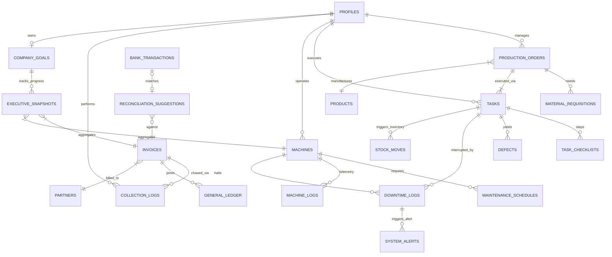

# Final Master ERP Database Diagram

This is the **Unified Database Design** connecting all 4 roles.

## How It Counts & Connects
1.  **Counting Production**: `TASKS` (Staff) updates `PRODUCTION_ORDERS.quantity_actual` (Manager).
2.  **Counting Money**: `INVOICES` (Accountant) and `STOCK_MOVES` (Staff) feed `GENERAL_LEDGER` and `EXECUTIVE_SNAPSHOTS` (CEO).
3.  **Counting Efficiency**: `DOWNTIME_LOGS` (Staff) updates `MACHINES.oee_score` (Manager).
