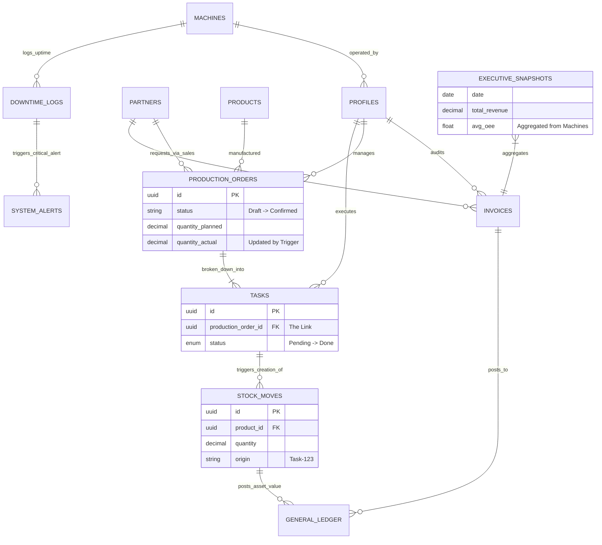

# Unified ERP Master Architecture Diagram

This diagram visualizes the **Unified "Golden Thread" Architecture**, connecting Staff, Managers, Accountants, and the CEO into a single cohesive system.

## Key Integration Points ("The Glue")

1.  **Execution Link**: `PRODUCTION_ORDERS` (Manager) are the parents of `TASKS` (Staff).
    *   *Automation:* Completing a Task *automatically* updates the Order progress.
2.  **Financial Link**: `TASKS` create `STOCK_MOVES`.
    *   *Automation:* A finished task *automatically* increments inventory Assets in the Ledger.
3.  **Strategic Link**: `DOWNTIME_LOGS` (Staff) create `SYSTEM_ALERTS` (CEO).
    *   *Automation:* A machine breakdown *automatically* notifies the CEO.
