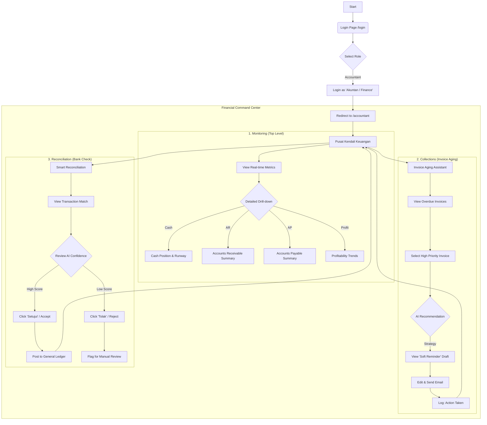

# Accountant User Flow

This document outlines the user flow for the **Accountant** role.

## 1. High-Level Overview

The Accountant interface is built as a **"Financial Command Center"**. Unlike the Staff role which is transactional, this role is **analytical and action-oriented** (Validation & Decision Making).

**Primary Goal**: Monitor financial health, accelerate collections (AR), and ensure data accuracy (Reconciliation).

## 2. Detailed User Flow (Mermaid)

## 3. Key Use Cases

### Scenario A: Morning Health Check
1.  **Login**: User logs in as Accountant.
2.  **Overview**: Immediately sees the "Cash Position" (Is it low?) and "Receivables" (Who owes us?).
3.  **Insight**: Notices Profitability is down due to a spike in COGS (implied context).

### Scenario B: AI-Assisted Collections (The "Hustle")
1.  **Trigger**: Sees "Total Receivables" is high.
2.  **Action**: Moves to **Invoice Aging** Card.
3.  **Selection**: Clicks on "PT. Retail Besar" (Overdue 15 Days).
4.  **AI Assist**: System generates a friendly but firm email draft.
5.  **Execution**: User clicks "Kirim" (Send) to trigger the collection process.

### Scenario C: Fast-Path Reconciliation
1.  **Trigger**: A payment notification comes in.
2.  **Action**: Moves to **Bank Reconciliation** Card.
3.  **Validation**: Sees "Incoming Rp 150M" matched with "Invoice INV-001" (98% Confidence).
4.  **Execution**: Clicks **Setujui**. The ledger is updated instantly.
