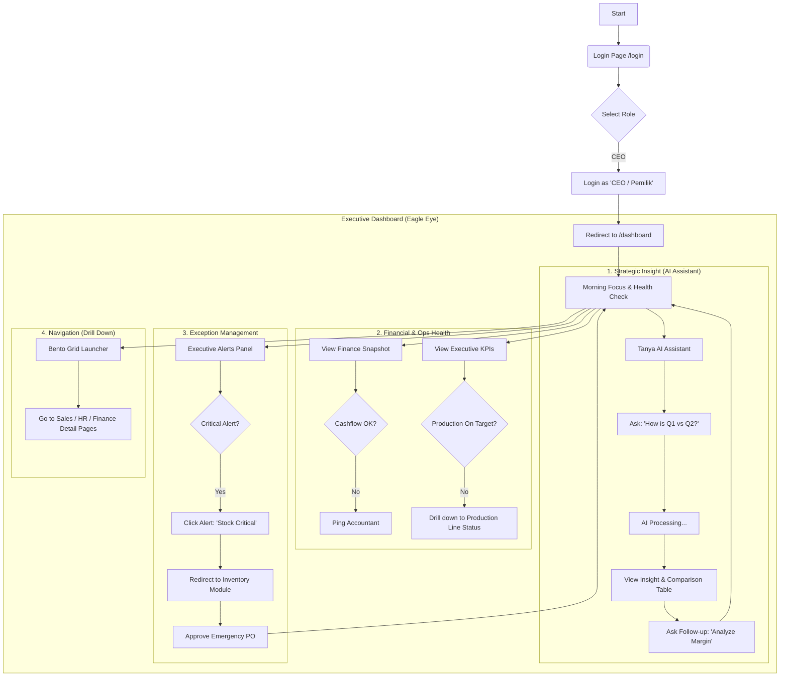

# CEO (Executive) User Flow

This document outlines the user flow for the **CEO / Owner** role.

## 1. High-Level Overview

The CEO interface is the **"Eagle Eye"**. It aggregates data from all other roles (Staff, Accountant, Manager) into high-level insights. It is designed for **Exception-Based Management**—only highlighting what needs immediate attention or strategic decisions.

**Primary Goal**: Monitor overall health, ask strategic questions (AI), and drill down only when critical alerts appear.

## 2. Detailed User Flow (Mermaid)

## 3. Key Use Cases

### Scenario A: The Morning Briefing (Coffee Routine)
1.  **Login**: User logs in while having coffee.
2.  **Focus**: Checks "Morning Focus" card for high-level summary.
3.  **Finance**: Glances at "Finance Snapshot" to ensure Cash Runway is green.
4.  **AI Query**: Asks "Tanya AI": *"What is our top selling product this week?"* to get a quick pulse on market trends.

### Scenario B: Crisis Intervention
1.  **Trigger**: "Executive Alerts" flashes a Red Alert: "Line 1 Stopped - Material Shortage".
2.  **Investigation**: Scrolls down to "Production Line Status" widget. Confirms Line 1 is blinking RED.
3.  **Action**: Clicks the alert to jump to **Inventory Dashboard**.
4.  **Resolution**: Sees a "Pending PO" for Cotton. Calls the Procurement Manager or approves the PO immediately.

### Scenario C: Strategic Planning
1.  **Trigger**: End of Month review.
2.  **Analysis**: Uses "Tanya AI" to compare "Q1 vs Q2 Sales".
3.  **Visualization**: Views the generated Comparison Table in the pop-up.
4.  **Decision**: Decides to increase marketing spend for Q3 based on the growth trend.
