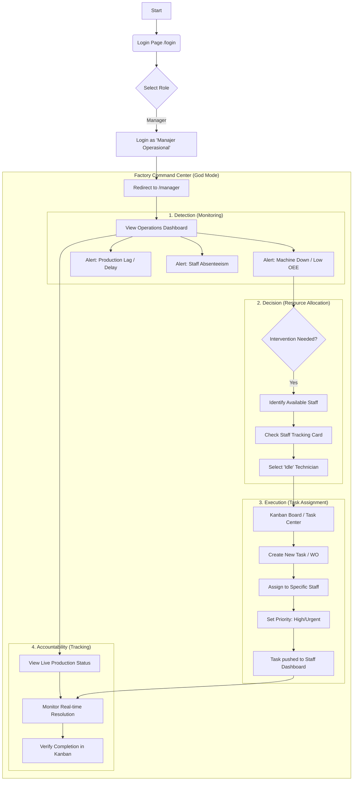

# Manager User Flow

This document outlines the user flow for the **Manager** role (Factory Manager / Plant Director).

## 1. High-Level Overview

The Manager interface is designed as a **"God Mode" Command Center**. It provides total visibility into operations, empowering the manager to detect issues instantly and assign resources effectively.

**Primary Goal**: Orchestrate the factory. Detect bottlenecks (Metrics), assign work (Kanban), and ensure accountability (Staff Tracking).

## 2. Detailed User Flow (Mermaid)

## 3. Key Use Cases

### Scenario A: Incident Response (Machine Breakdown)
1.  **Trigger**: "Operations Dashboard" shows OEE drop in Weaving Line 1.
2.  **Verify**: Manager looks at "Live Production Status" (Visual Map) and confirms Line 1 is RED (Down).
3.  **Resourcing**: Checks "Staff Activity Tracker". Sees Technician Budi is "Idle".
4.  **Action**: Drags a "Maintenance Ticket" to the "To Do" column in the **Kanban Board** and assigns it to Budi.
5.  **Outcome**: Budi receives the notification immediately on his Staff App.

### Scenario B: Production Planning
1.  **Monitor**: Checks "Efficiency Trends" in the dashboard.
2.  **Decision**: Decides to prioritize the "ZARA-2026" order to meet the deadline.
3.  **Action**: Reorders cards in the **Kanban Board** to move ZARA tasks to top priority.
4.  **Outcome**: Staff see these tasks first in their "Shift Pagi" list.

### Scenario C: Accountability Check
1.  **Monitor**: Checks "Manager Workload" card.
2.  **Insight**: Sees "Andi (Supervisor A)" has 5 Overdue tasks.
3.  **Action**: Clicks to drill down and possibly reassign tasks to a less burdened supervisor.
