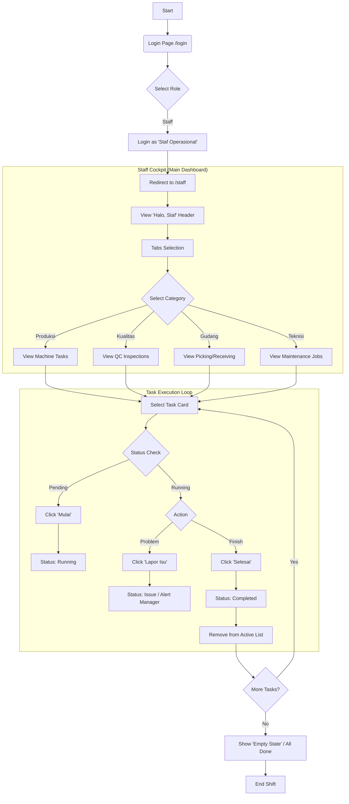

# Staff User Flow

This document outlines the user flow for the **Staff** role (Operators, QC, Warehouse Staff) within the ERP system.

## 1. High-Level Overview

The Staff role is designed for "boots-on-the-ground" execution. The interface is simplified (Cockpit mode) to focus on daily tasks, minimizing distractions.

**Primary Goal**: View assigned tasks, execute them, and report status changes (Start, Issue, Done).

## 2. Detailed User Flow (Mermaid)

## 3. Key Use Cases

### Scenario A: Production Operator
1.  **Login**: User logs in and lands on `/staff`.
2.  **Select Context**: Clicks the "Produksi" tab.
3.  **Start Job**: Finds "WO-WEAV-1023", clicks **Mulai**. System timestamps entry.
4.  **Execute**: Runs the machine.
5.  **Finish**: Clicks **Selesai**. The task moves to completed history.

### Scenario B: Quality Control (QC)
1.  **Login**: User logs in.
2.  **Select Context**: Clicks "Kualitas" tab.
3.  **Inspection**: Sees "Q-201 Inspeksi Inline".
4.  **Action**: Performs inspection. If defect found, might click "Lapor Isu" (though basic flow uses Selesai for successful check).
5.  **Completion**: Marks task as Done.

### Scenario C: Warehouse Staff
1.  **Login**: User logs in.
2.  **Select Context**: Clicks "Gudang" tab.
3.  **Picking**: Sees "W-301 Picking Benang".
4.  **Action**: Physically picks items, clicks **Selesai** to confirm handover.
